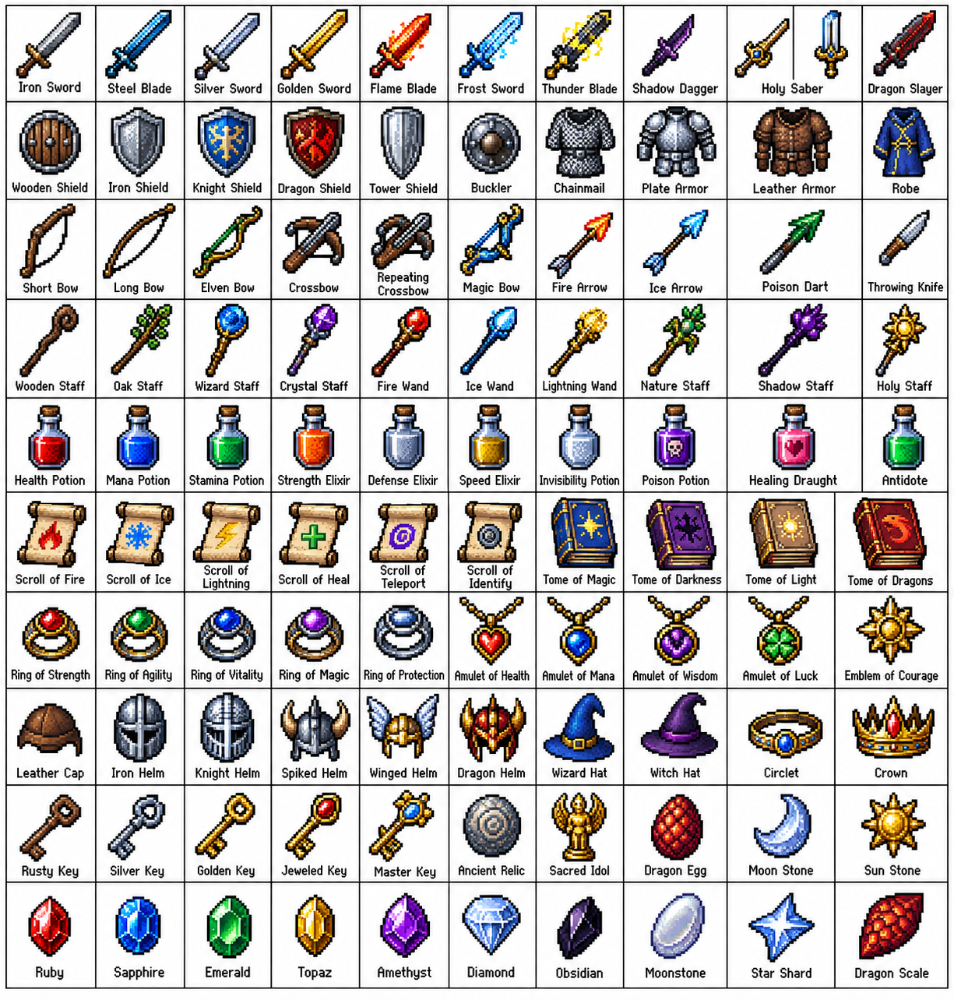

# 评测报告：GPT Image · 像素 RPG 百物网格

> 开源分享硬门槛：本页必须能直接看见成图。缺图 = 不可 PR。
> 对应提示词：[GPTImage-像素RPG百物网格](GPTImage-像素RPG百物网格.md)

## Prompt

```text
Create a 10 × 10 grid of 100 different fantasy RPG items rendered in classic pixel art style (16-bit or 32-bit sprite aesthetic, reminiscent of SNES/GBA-era JRPGs). Each item should appear in its own square tile with a short clear label underneath. Keep the grid neat on a white background. Make every item visually distinct and every label correctly spelled. Use crisp pixel edges, limited palette per sprite, and subtle dithering for shading.
Use these row themes:
Row 1: swords and blades
Row 2: shields and armor
Row 3: bows, crossbows, and ranged weapons
Row 4: staves, wands, and magical foci
Row 5: potions, elixirs, and flasks
Row 6: scrolls, tomes, and spellbooks
Row 7: rings, amulets, and enchanted trinkets
Row 8: helmets, crowns, and headgear
Row 9: keys, relics, and quest items
Row 10: gems, runes, and crafting materials
Show each tile as a centered item sprite on a clean background square, rendered as a classic inventory icon — the kind you'd see in a fantasy RPG menu. Keep the overall style consistent, cohesive, and reminiscent of beloved retro fantasy RPGs — charming, detailed, and instantly readable at small sizes.
```

## Fixture

- `fixture`：无参考图；10×100 像素 RPG 物品网格直接出图
- `fixture_source`：`official`（用户/源图·官方槽位出图）
- `model` / 跑台：gpt-6-astra medium · Codex image_gen（prompt-lab / Codex image_gen）

## 成图（必嵌）

### B · 待测 Prompt 输出



## 摘要

通挂：10×10 白底网格、像素风、行主题大体对齐；风险：标签拼写与是否真满 100/无重复需抽查。

## 判定

- 动作：入库
- 开源：可分享（图齐）
- 日期：2026-09-14

## 四维（可选短表）

| 维度 | 可见表现 |
| --- | --- |
| 结构 | 整齐 10×10 网格 + 每格标签 |
| 约束 | 像素边/有限色/白底命中 |
| 胡编/扩写 | 未见乱排或糊成一片 |
| 可复现 | 风格与布局可复跑 |
