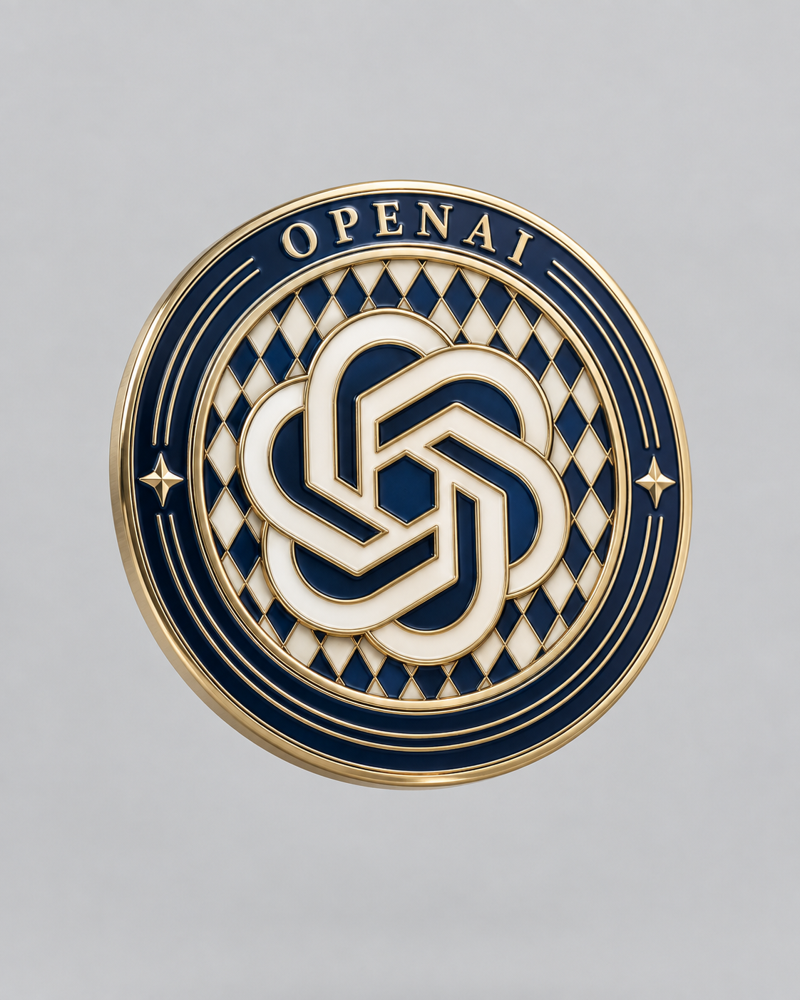

# 评测报告：GPT Image · 品牌硬珐琅徽章

> 开源分享硬门槛：本页必须能直接看见成图。缺图 = 不可 PR。
> 对应提示词：[GPTImage-品牌硬珐琅徽章](GPTImage-品牌硬珐琅徽章.md)

## Prompt

```text
[BRAND NAME = ___________________]
[PRIMARY ENAMEL COLOR = _______]
[ACCENT ENAMEL COLOR = ________]
[BACKGROUND COLOR = __________]

Create a vertical 4:5 photorealistic studio product image of the authentic official standalone symbol of [BRAND NAME], physically fabricated as the central emblem of a small vintage European automobile-club hard-enamel medallion, floating freely in space.

CORE VISUAL SYSTEM

The result must look like a newly manufactured collectible die-struck brass and hard-enamel badge photographed in a clean neutral product studio — not a flat logo, graphic illustration, app icon, generic extrusion or visibly synthetic CGI render.

Combine three systems:
1. the exact authentic geometry of the official [BRAND NAME] symbol;
2. the dense heraldic construction of a vintage motorsport-club medallion;
3. the clean material behavior of precision-manufactured cloisonné enamel jewelry.

The badge should inherit the design language of a vintage object, but its physical condition must be pristine, freshly manufactured and carefully polished. Do not simulate age through surface damage, discoloration or texture.

BRAND ACCURACY

Automatically identify the most recognizable authentic official standalone symbol of [BRAND NAME]. Preserve its canonical silhouette, proportions, stroke relationships, characteristic curves, intersections, counterforms, internal negative spaces and component spacing.

Do not redesign, simplify, substitute or loosely reinterpret the identity. Use the official wordmark only when no recognizable standalone symbol exists.

Translate the logo into physically separated hard-enamel cells bounded by fine raised metal partitions. The logo must remain immediately recognizable at normal viewing distance. Preserve all essential internal divisions, but omit details too small to be physically manufactured rather than inventing inaccurate replacements.

BADGE CONSTRUCTION

Fabricate the object as a real circular die-struck brass medallion approximately 65–80 mm in diameter and 2–3 mm thick.

Build it from a narrow polished outer metal rim, a broad circular enamel ring, several fine concentric raised brass lines, one recessed central emblem field, the authentic [BRAND NAME] symbol occupying most of the center, a dense vintage harlequin diamond pattern behind the symbol and restrained symmetrical line ornaments filling unused sections of the outer ring.

All outlines, dividers, lettering and internal logo details must be formed by the same continuous raised metal structure. Raised brass partitions should sit approximately 0.15–0.35 mm above the enamel. Use narrow rounded ridges rather than thick extruded outlines.

The outer ring may display the exact brand name once in small raised capital lettering, cleanly integrated into the medallion. Do not invent slogans, dates, model names or additional text. Fill remaining ring space with concentric lines rather than fake typography.

Maintain believable stamped-metal and enamel-filled construction, realistic edge thickness and precise material junctions. Do not add a visible stand, mounting support, pedestal or surface beneath the badge.

COLOR ARCHITECTURE

Use [PRIMARY ENAMEL COLOR] as the dominant chromatic enamel across the outer ring and selected areas of the central diamond pattern.

Use [ACCENT ENAMEL COLOR] as the secondary enamel field and narrow inner-ring accent.

Alternate the central harlequin pattern between [PRIMARY ENAMEL COLOR] and controlled ivory enamel. Render the authentic logo primarily in ivory enamel so it remains clearly separated from the patterned field.

Use polished neutral champagne-gold plated brass for every raised partition, contour, rim, letter and structural line.

Keep the gold visually neutral and restrained: pale champagne gold rather than yellow gold, orange gold, antique brass or copper. Gold color must remain confined to the metal itself and must not contaminate the enamel, background, shadows or overall image.

Do not inherit the logo’s native brand colors unless they already correspond to the defined palette.

MATERIAL SYSTEM

METAL

Use clean jewelry-grade gold-plated brass with a pale neutral champagne tone, controlled reflectivity and roughness approximately 0.12–0.20.

The raised metal faces are smoothly polished with crisp continuous reflections. Narrow recesses may appear slightly darker through natural light occlusion, not through dirt or tarnish.

Keep the metal surface exceptionally clean and materially uniform. Allow only microscopic polishing character that is invisible at normal viewing size. Do not generate visible grain, mottling, cloudy patches, dark stains, edge wear, scratches, dents, oxidation, patina or artificial distressed texture.

ENAMEL

Use opaque vitreous hard enamel with smooth, evenly filled, subtly domed cell surfaces, roughness approximately 0.07–0.13, dense color, clean dielectric reflections and restrained optical depth.

The enamel must have consistent color density across every cell. It should feel glassy and finely polished, never cloudy, marbled, dusty, scratched, speckled, waxy or unevenly pigmented.

[PRIMARY ENAMEL COLOR] must remain deep, saturated and chromatically clean.

Ivory enamel should be softly off-white but visually neutral. It must not cast a yellow or cream tint across the image.

Add only narrow natural ambient-occlusion lines where enamel meets raised brass. Realism must come from geometry, material depth, Fresnel response and controlled reflections — not from visible wear or procedural surface noise.

LIGHTING AND COLOR BALANCE

Place the floating badge inside a clean neutral-white studio lighting environment.

Use one very large rectangular neutral-white softbox above and slightly left of the camera. Add weak neutral frontal fill and a subtle neutral right-side bounce, maintaining an approximate 2:1 key-to-fill ratio.

Produce broad, clean and uninterrupted softbox reflections across the enamel and narrow controlled highlight ribbons along the raised gold contours. Reflections should reveal the shallow enamel relief without creating white scratches, random hotspots or noisy surface variation.

Use strictly neutral daylight-balanced illumination at approximately 5200–5600K with a neutral camera white balance. Remove all amber color cast, warm atmospheric spill and yellow-tinted highlight roll-off.

White and pale-gray areas must remain spectrally neutral. Shadows should be soft neutral gray rather than beige, brown or yellow. Preserve the true deep-green enamel color without olive or muddy yellow contamination.

Do not apply a warm cinematic grade, nostalgic color filter, vintage film cast, sepia tint or golden ambient light.

FLOATING OBJECT

Suspend the medallion freely in the air, approximately 10–15 cm above any implied surface, with no physical support.

The badge must cast no contact shadow because it does not touch a surface. If needed for spatial separation, allow only an extremely faint, broad, neutral-gray diffused shadow far below the object, with no visible floor plane.

The object should feel calmly suspended rather than thrown, falling or rotating dynamically.

CAMERA AND COMPOSITION

Use a vertical 4:5 composition with generous clean negative space.

The medallion occupies approximately 48–55% of the frame width and sits near the optical center, slightly below the vertical midpoint. Show the entire object without cropping.

Rotate the badge only 2–4 degrees sideways and tilt its face approximately 5–8 degrees backward. Keep the face nearly frontal and the circular geometry visually stable. Reveal only a narrow amount of physical thickness along the lower and side edges.

Use the visual character of an 85–105 mm full-frame macro lens with restrained perspective compression and no wide-angle deformation.

Focus on the central logo and front enamel plane at approximately f/7.1–f/9. Keep nearly the entire badge face sharp, with only mild natural softening along the most distant edge. Do not use exaggerated shallow depth of field or miniature-effect blur.

BACKGROUND

Render [BACKGROUND COLOR] as a perfectly clean, continuous, evenly illuminated background.

The background must contain no visible floor, horizon line, corner, wall transition, paper texture, grain, stains, color variation, decorative elements or environmental reflections.

Keep it neutral and uncluttered, with no warm gradient, beige falloff, yellow center, vignette, halo or spotlight behind the object.

Create separation through the badge’s silhouette, controlled reflections and minimal tonal contrast rather than through background effects.

RENDER CHARACTER

Photoreal path-traced CGI matched to a carefully retouched high-end macro product photograph.

Preserve realistic metal Fresnel behavior, smooth enamel reflections, accurate shallow relief, narrow material junctions, restrained ambient occlusion and neutral photographic highlight roll-off.

The final image should feel tactile, precise and physically collectible: a pristine piece of newly manufactured automotive jewelry.

Surface cleanliness is critical. The render may contain subtle optical complexity, but no visible generative texture, procedural grunge or fake material aging.

NEGATIVE CONSTRAINTS

No flat printed logo.
No sticker or decal.
No generic extruded logo placed on a circle.
No thick chunky bevels.
No inflated or rounded app-icon geometry.
No plastic gold.
No orange or strongly yellow gold.
No mirror chrome.
No brushed metal.
No visible grain or surface noise.
No cloudy enamel.
No mottled green areas.
No scratches, scuffs or edge wear.
No patina, oxidation, tarnish or corrosion.
No stains, dirt or fingerprints.
No warm color cast.
No amber lighting.
No sepia or nostalgic grading.
No beige or yellow background contamination.
No visible floor or horizon.
No contact with a surface.
No support, stand, wire or pedestal.
No dramatic rotation or falling pose.
No packaging.
No separate caption, watermark or wordmark below the object.
No invented typography or unreadable pseudo-text.
No vignette, halo or background gradient.
No extreme macro blur.
No random specular noise.
```

## Fixture

- `fixture`：BRAND NAME=OpenAI; PRIMARY=navy; ACCENT=gold; BACKGROUND=soft gray
- `fixture_source`：`official`（用户/源图·官方槽位出图）
- `model` / 跑台：gpt-6-astra medium · Codex image_gen（prompt-lab / Codex image_gen）

## 成图（必嵌）

### B · 待测 Prompt 输出



## 摘要

通挂：OpenAI 标 + navy/gold 硬珐琅浮雕清晰；风险：外环星标等轻微扩写（通常不挡入库）。

## 判定

- 动作：入库
- 开源：可分享（图齐）
- 日期：2026-09-14

## 四维（可选短表）

| 维度 | 可见表现 |
| --- | --- |
| 结构 | 4:5 影棚悬浮徽章 |
| 约束 | PRIMARY/ACCENT 色与硬珐琅分区命中 |
| 胡编/扩写 | 外环装饰星标轻微扩写 |
| 可复现 | 槽位色通挂，可换品牌复跑 |
