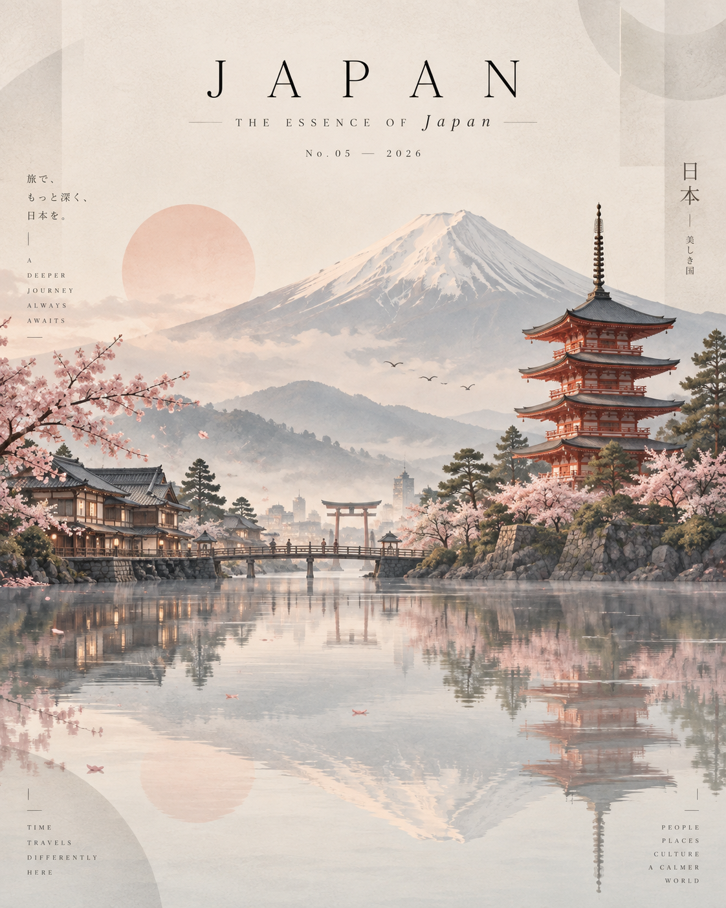

# 评测报告：GPT Image · 国家极简旅行编辑插画

> 开源分享硬门槛：本页必须能直接看见成图。缺图 = 不可 PR。
> 对应提示词：[GPTImage-国家极简旅行编辑插画](GPTImage-国家极简旅行编辑插画.md)

## Prompt

```text
Create a premium 4:5 vertical editorial travel artwork featuring [COUNTRY] transformed into a sophisticated minimalist landscape.

The entire identity of [COUNTRY] should appear as one seamless, dreamlike composition rather than a collection of separate objects. Place the country’s most iconic natural landmark or landscape in the background, softly painted with atmospheric depth. In the foreground, feature one or two instantly recognizable architectural landmarks of [COUNTRY], rendered as elegant simplified forms with refined geometric details.

Surround the architecture with subtle elements that represent the country — native trees, traditional rooftops, local streets, cultural details, and a few tiny human silhouettes — all integrated naturally into the scene.

Use a soft luxury editorial palette: warm ivory, misty beige, muted pastel tones, dusty pink, pale blue, soft sage and gentle charcoal accents. Keep the colors slightly desaturated and harmonious.

Create a beautiful glass-like reflective surface beneath the landscape so the architecture, trees and mountains create delicate vertical reflections. Add extremely subtle translucent geometric shapes around the edges, giving the artwork a contemporary art-gallery feel.

Composition should be spacious, calm and elegant, with generous negative space and a clean horizon. Use soft atmospheric haze, delicate shadows, subtle paper texture, fine architectural linework and restrained watercolor/gouache aesthetics blended with modern digital illustration.

At the top, add sophisticated magazine-style typography:

[COUNTRY]
THE ESSENCE OF [COUNTRY]
No. 05 — 2026

Typography should be small, refined, widely spaced and perfectly aligned, like a luxury travel magazine cover.

No clutter, no excessive details, no photorealistic collage, no oversized text. The result should feel like a high-end contemporary travel poster, collectible art print and luxury magazine cover — serene, artistic, instantly recognizable and visually unforgettable.
```

## Fixture

- `fixture`：COUNTRY=Japan
- `fixture_source`：`official`（用户/源图·官方槽位出图）
- `model` / 跑台：gpt-6-astra medium · Codex image_gen（prompt-lab / Codex image_gen）

## 成图（必嵌）

### B · 待测 Prompt 输出



## 摘要

通挂：Japan 地标一体构图、镜面水面、杂志顶栏字；风险：侧栏竖排短句轻微扩写。

## 判定

- 动作：入库
- 开源：可分享（图齐）
- 日期：2026-09-14

## 四维（可选短表）

| 维度 | 可见表现 |
| --- | --- |
| 结构 | 4:5 竖版单一无缝编辑海报 |
| 约束 | Japan 地标+自然+配色命中 |
| 胡编/扩写 | 侧栏多出未要求竖排短句 |
| 可复现 | 槽位国家可替换复跑 |
