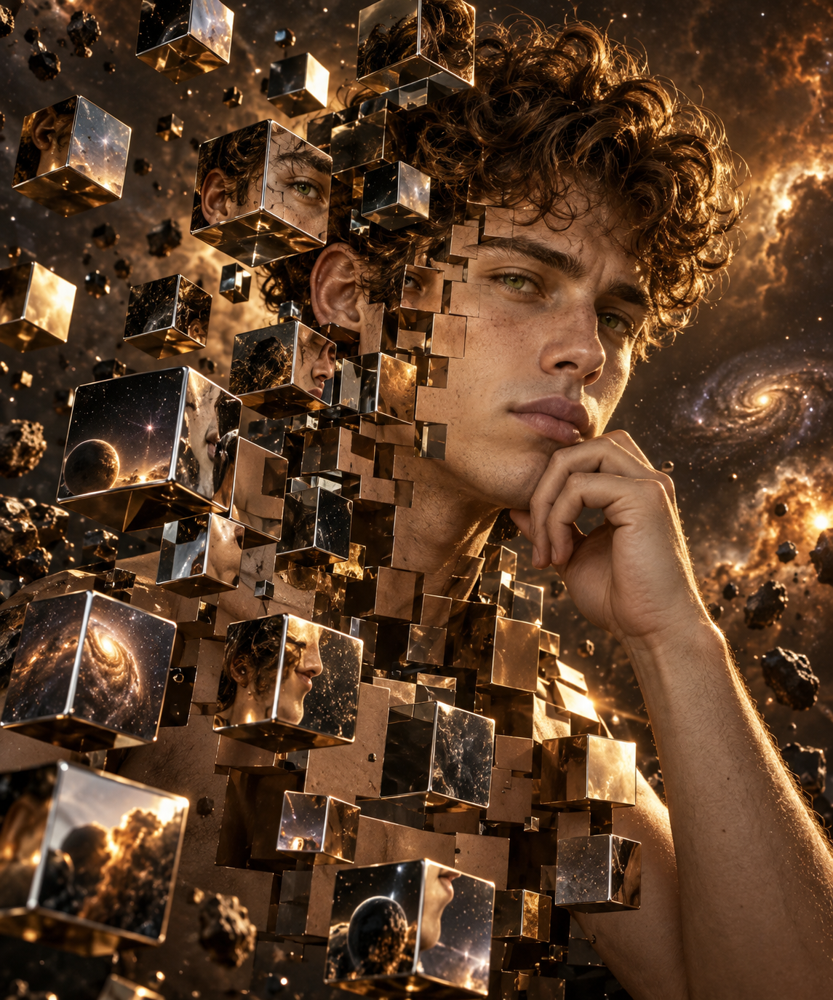

# 评测报告：GPT Image · 超现实金属方块肖像（JSON）

> 开源分享硬门槛：本页必须能直接看见成图。缺图 = 不可 PR。
> 对应提示词：[GPTImage-超现实金属方块肖像-JSON](GPTImage-超现实金属方块肖像-JSON.md)

## Prompt

```text
{
  "subject": "A handsome young man with curly brown hair and green eyes, resting his chin on his hand with a thoughtful expression.",
  "concept": "Surreal deconstruction. The subject's face and upper body are being fragmented into a series of floating, 3D metallic cubes.",
  "visual_effects": {
    "reflections": "Chrome and bronze mirrored surfaces on the cubes, reflecting parts of the subject and a cosmic background.",
    "atmosphere": "Dust particles and small debris floating in a dark, warm-toned nebular space.",
    "lighting": "Cinematic side-lighting with high contrast and golden hour highlights."
  },
  "style": "Hyper-realistic digital art, fine art photography, octane render, 8k resolution."
}
```

## Fixture

- `fixture`：JSON prompt verbatim（无 photo ref）
- `fixture_source`：`official`（用户/源图·官方槽位出图）
- `model` / 跑台：gpt-6-astra medium · Codex image_gen（prompt-lab / Codex image_gen）

## 成图（必嵌）

### B · 待测 Prompt 输出



## 摘要

通挂：方块解构镀铬肖像 + 侧光星云；风险：星云细节略多于 dust particles 字面（氛围扩写）。

## 判定

- 动作：入库
- 开源：可分享（图齐）
- 日期：2026-09-14

## 四维（可选短表）

| 维度 | 可见表现 |
| --- | --- |
| 结构 | 托腮肖像 + 浮空金属立方解构 |
| 约束 | JSON 主体/概念/视效命中 |
| 胡编/扩写 | 背景星云略丰于字面 |
| 可复现 | 无参考图即可复现 |
