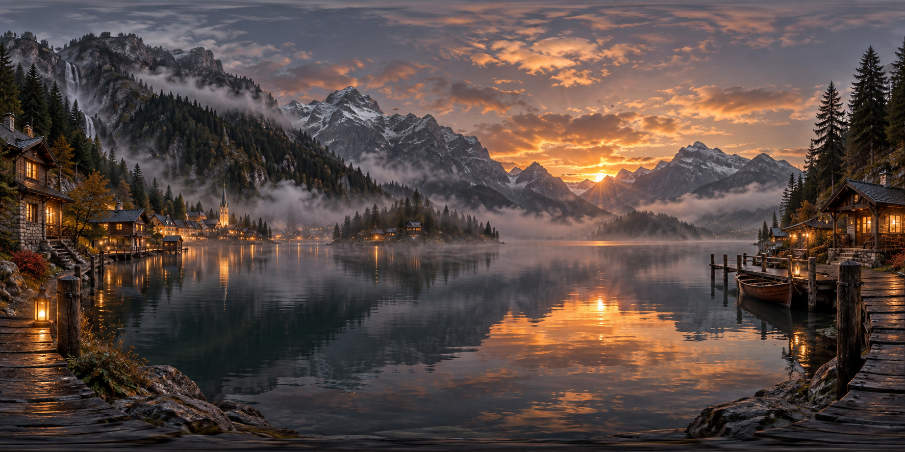

# 评测报告：GPT Image 2 · 360等距柱状全景

> 开源分享硬门槛：本页必须能直接看见成图。缺图 = 不可 PR。
> 对应提示词：[GPTImage2-360等距柱状全景](GPTImage2-360等距柱状全景.md)

## Prompt

```text
360 度等距柱状全景图（equirectangular），[在这里填场景描述]，高细节，沉浸感，电影级光影，2:1 宽高比
```

## Fixture

- `fixture`：scene=misty mountain lake village dusk
- `fixture_source`：`official`（用户/源图·官方槽位出图）
- `model` / 跑台：gpt-6-astra medium · Codex image_gen（prompt-lab / Codex image_gen）

## 成图（必嵌）

### B · 待测 Prompt 输出



## 摘要

通挂：2:1 equirectangular 友好宽幅 + 雾山湖村黄昏槽位可识别；沉浸暖窗光+雾。

## 判定

- 动作：入库
- 开源：可分享（图齐）
- 日期：2026-09-15

## 四维（可选短表）

| 维度 | 可见表现 |
| --- | --- |
| 结构 | 约 2:1 全景环视构图 |
| 约束 | 槽位场景与电影级光影命中 |
| 胡编/扩写 | 未见无关现代城市抢戏 |
| 可复现 | 槽位填入后可复跑 |
