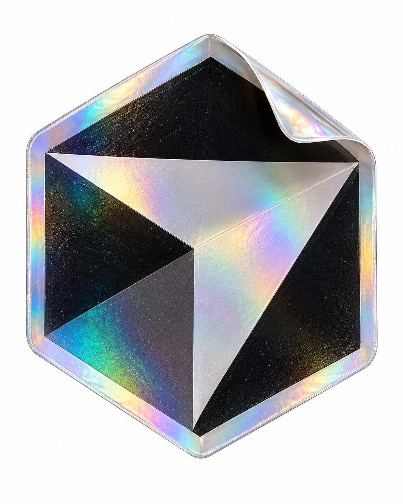

# 评测报告：GPT Image 2 · 品牌全息乙烯贴纸

> 开源分享硬门槛：本页必须能直接看见成图。缺图 = 不可 PR。
> 对应提示词：[GPTImage2-品牌全息乙烯贴纸](GPTImage2-品牌全息乙烯贴纸.md)

## Prompt

```text
[BRAND_NAME = ______]  
[BACKGROUND_COLOR = White]  

Create a premium studio product photograph of a custom die-cut vinyl sticker for [BRAND_NAME].  Automatically identify the brand’s most recognizable official symbol, emblem, or standalone logo and use its authentic silhouette as the shape of the sticker. Preserve the mark’s characteristic proportions, geometry, internal spacing, and core color relationships. Do not redesign, simplify, or replace the identity with a generic interpretation. If the brand is primarily represented by a wordmark, reproduce the wordmark as accurately and legibly as possible.  Present the logo as a real, collectible-grade laminated vinyl object. The printed brand artwork remains clearly visible underneath a transparent prismatic finish. Across the surface, create controlled spectral reflections in cyan, turquoise, magenta, violet, emerald, amber, soft gold, and pearlescent white. The iridescence should shift naturally with the curvature and lighting rather than appearing as a flat rainbow gradient.  Give the material convincing physical depth: a smooth glossy laminate, subtly raised printed areas, fine vinyl grain, restrained micro-scratches, faint handling marks, realistic edge thickness, tiny surface imperfections, and crisp die-cut borders.  Add one clean upper corner that is gently peeled back. The peeled corner must remain structurally unified as a single smooth curled piece, not split into multiple layers or separate flaps. It should feel neat, premium, and physically believable, with smooth curvature, subtle translucency, controlled internal reflections, and accurate shadows. Suggest the object’s laminated construction through thickness, edge behavior, and underside visibility, but do not show messy delamination, tearing, fraying, or a visibly separated multi-layer stack. The sticker should feel new and collectible, not old or worn out.  Composition: one oversized sticker centered in a vertical 4:5 frame, occupying most of the image. Show it almost front-facing with a subtle three-quarter perspective so the thickness and curled corner remain visible. Keep the silhouette clean and instantly recognizable.  Place the sticker isolated against a seamless solid [BACKGROUND_COLOR] studio background. The sticker should appear suspended in space, not resting on a floor or surface. Use a large diffused key light from the upper left, a narrow rim light from the opposite side, restrained frontal fill, and carefully controlled highlights. Keep the background clean and even.  High-end macro product photography, 85–100mm lens character, shallow but controlled depth of field, the main logo face sharply focused, distant edges and the peeled corner falling slightly softer. High dynamic range, realistic contrast, physically accurate materials, premium collectible-object presentation, polished commercial photography, highly detailed.  Do not add a poster layout, captions, slogans, social-media interface, packaging, hands, multiple stickers, decorative objects, scenery, smoke, excessive bloom, neon cyberpunk lighting, liquid deformation, melting surfaces, chrome replacing the vinyl, distorted logo geometry, invented symbols, duplicated elements, misspelled brand text, visible floor planes, pedestal surfaces, contact reflections, mirrored reflections, or grounded tabletop shadows.
```

## Fixture

- `fixture`：BRAND_NAME=Cursor; BACKGROUND_COLOR=White
- `fixture_source`：`official`（用户/源图·官方槽位出图）
- `model` / 跑台：gpt-6-astra medium · Codex image_gen（prompt-lab / Codex image_gen）

## 成图（必嵌）

### B · 待测 Prompt 输出



## 摘要

通挂：全息棱镜、一角轻揭、白底影棚强；风险：Cursor 官方轮廓偏抽象，品牌真伪需人眼认。

## 判定

- 动作：入库
- 开源：可分享（图齐）
- 日期：2026-09-14

## 四维（可选短表）

| 维度 | 可见表现 |
| --- | --- |
| 结构 | 悬浮贴纸一体，右上角揭起 |
| 约束 | 全息材质句与无多余文案命中 |
| 胡编/扩写 | 标识几何化，非官方 silhouette 风险 |
| 可复现 | 材质系统可复跑；换品牌槽位可再验 |
