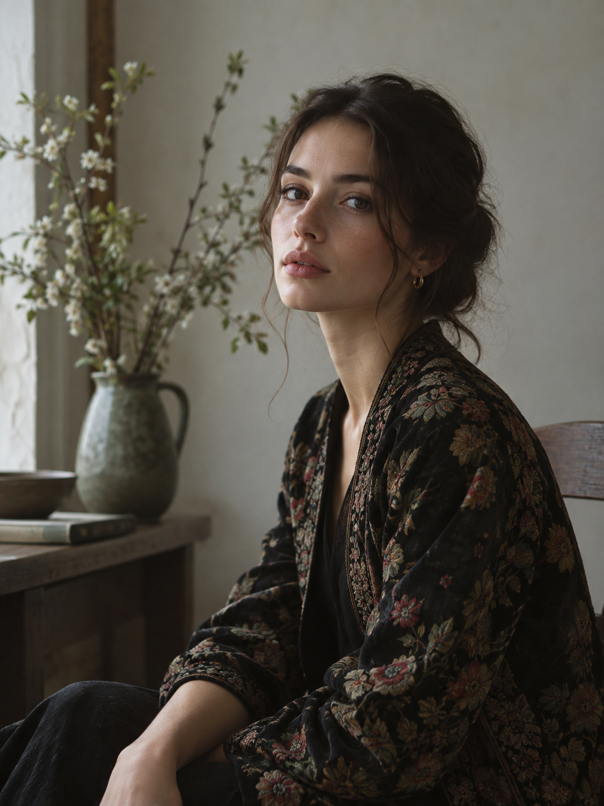
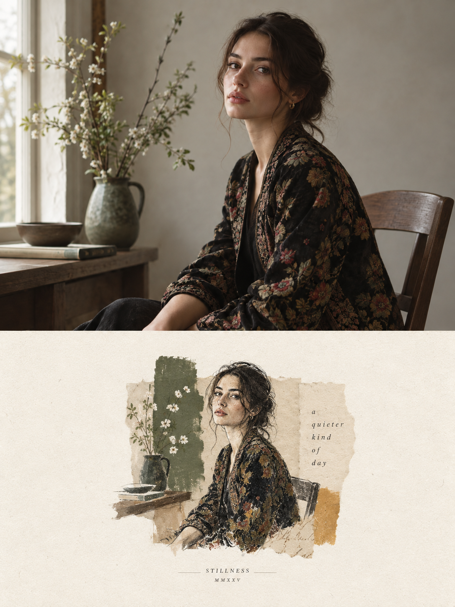

# 评测报告：GPT Image 2 · 对半编辑艺术海报

> 开源分享硬门槛：本页必须能直接看见成图。缺图 = 不可 PR。
> 对应提示词：[GPTImage2-对半编辑艺术海报](GPTImage2-对半编辑艺术海报.md)

## Prompt

```text
Create a premium editorial art poster for every uploaded photograph, treating each image as its own independent composition and never merging multiple photos together. Use a strict 3:4 vertical format with the canvas split into two perfectly equal horizontal halves: the upper half should remain a faithful, photorealistic presentation of the original image, preserving the subject’s exact identity, facial features, proportions, pose, clothing, objects, composition, lighting, shadows, mood, and natural colors, enhanced only with sophisticated editorial color grading and seamless environmental extension where necessary; the lower half should transform the visual story into an entirely different artistic interpretation—a tiny, carefully composed handmade mixed-media artwork centered within expansive warm ivory negative space, occupying no more than 10–20% of the lower section, using expressive ink sketching, layered gouache-like color fields, subtle collage textures, torn-paper edges, imperfect brushwork, visible fibers, soft pigment variations, and charming human imperfections while retaining the most recognizable silhouette, gesture, objects, and emotional narrative from the original photo. Extract up to four dominant harmonious colors from each photograph and reinterpret them in a muted, sophisticated palette. Add only occasional understated editorial typography when it genuinely enhances the composition, such as a poetic title, place, date, or single word. The overall result should feel like a collectible contemporary art publication cover—minimal, poetic, tactile, elegant, emotionally quiet, visually distinctive, and unmistakably connected to its original photograph.
```

## Fixture

- `fixture`：synthetic 人像/静物上传照 → 严格上下对半
- `fixture_source`：`synthetic_codex`（Codex 合成 MAIN）
- `model` / 跑台：gpt-6-astra medium · Codex image_gen（prompt-lab / Codex image_gen）

## 成图（必嵌）

### MAIN-ref（synthetic_codex）



### B · 待测 Prompt 输出



## 摘要

通挂：严格上下对半（上写实/下混合媒介）+ 暖象牙大底；fixture=synthetic_codex。

## 判定

- 动作：入库
- 开源：可分享（图齐）
- 日期：2026-09-14

## 四维（可选短表）

| 维度 | 可见表现 |
| --- | --- |
| 结构 | 严格对半，下半≤约20%混合媒介区 |
| 约束 | 单图独立、克制短字 |
| 胡编/扩写 | 未见合并多图 |
| 可复现 | 换 synthetic MAIN 可复跑 |
