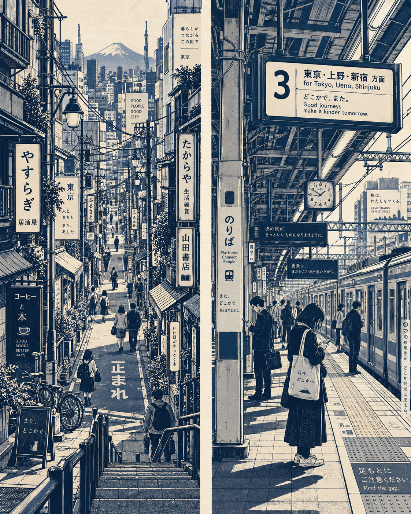

# 评测报告：GPT Image 2 · 日系街道海军线稿

> 开源分享硬门槛：本页必须能直接看见成图。缺图 = 不可 PR。
> 对应提示词：[GPTImage2-日系街道海军线稿](GPTImage2-日系街道海军线稿.md)

## Prompt

```text
Create a vertical editorial illustration inspired by the reference images, depicting a dense Japanese urban scene in a highly stylized navy-blue and warm ivory monochrome line-art aesthetic.

Show a narrow Japanese city street viewed from an elevated perspective, with tall tightly packed buildings on both sides, layered storefronts, balconies, windows, hanging signs, Japanese typography, utility poles, tangled overhead power cables, street lamps, awnings, railings, bicycles, and small architectural details. The street should lead naturally into the distance, creating strong depth and perspective.

Include several small pedestrians naturally walking through the scene—people carrying bags, checking phones, crossing the street, and walking in pairs. Keep them simplified but expressive, with clean silhouettes and minimal facial detail.

Use deep indigo/navy ink for all outlines, shadows, signs, cables, windows, and architectural details, contrasted against a warm cream/off-white paper background. Strong graphic shadows and large solid navy areas should create a bold screen-print/poster effect.

For the second scene, depict a Japanese railway station platform from a slightly elevated side perspective. Show detailed steel roof structures, beams, electrical cables, overhead signage, platform markings, tiled flooring, railway tracks, columns, railings, ticket-area structures, and several commuters waiting or walking while looking at their phones. Preserve the same visual language: precise architectural linework, simplified human figures, deep navy shadows, cream paper, and dense urban detail.

Style: Japanese urban sketchbook + architectural ink illustration + vintage travel poster + screen printing + manga-inspired environmental linework, intricate hand-drawn details, clean perspective, bold negative space, slightly imperfect ink texture, sophisticated editorial composition, nostalgic analog print feel.

Color palette: only deep navy blue, muted blue-gray, and warm ivory/cream. No bright colors.

Composition: highly detailed, visually dense, balanced foreground/midground/background, strong vanishing points, cinematic framing, crisp linework, subtle paper grain, premium art-book illustration.

Aspect ratio: 4:5 vertical.
```

## Fixture

- `fixture`：无 MAIN-ref；双场景海军线稿（窄街+站台）文本出图
- `fixture_source`：`official`（用户/源图·官方槽位出图）
- `model` / 跑台：gpt-6-astra medium · Codex image_gen（prompt-lab / Codex image_gen）

## 成图（必嵌）

### B · 待测 Prompt 输出



## 摘要

通挂：双场景（窄街+站台）/靛蓝海军线稿+象牙纸底/电线杆·行人剪影/4:5；风险：弱。

## 判定

- 动作：入库
- 开源：可分享（图齐）
- 日期：2026-09-15

## 四维（可选短表）

| 维度 | 可见表现 |
| --- | --- |
| 结构 | 左右分栏双场景成立，透视纵深清晰 |
| 约束 | 海军+象牙限色；无亮色 |
| 胡编/扩写 | 未见多余色板/字幕/水印 |
| 可复现 | B 样张风格通挂，可复跑 |
