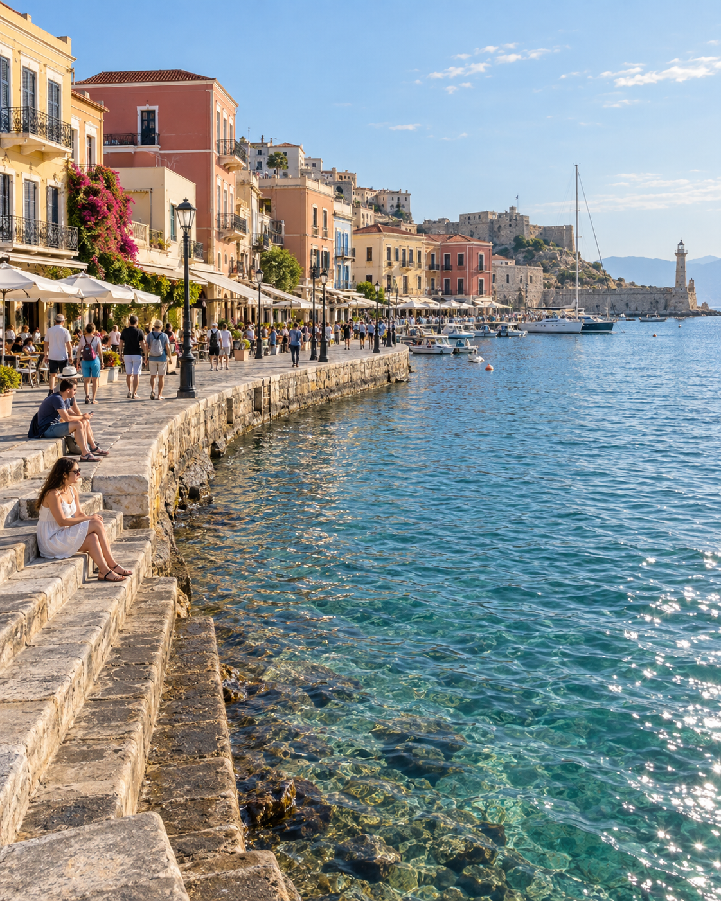
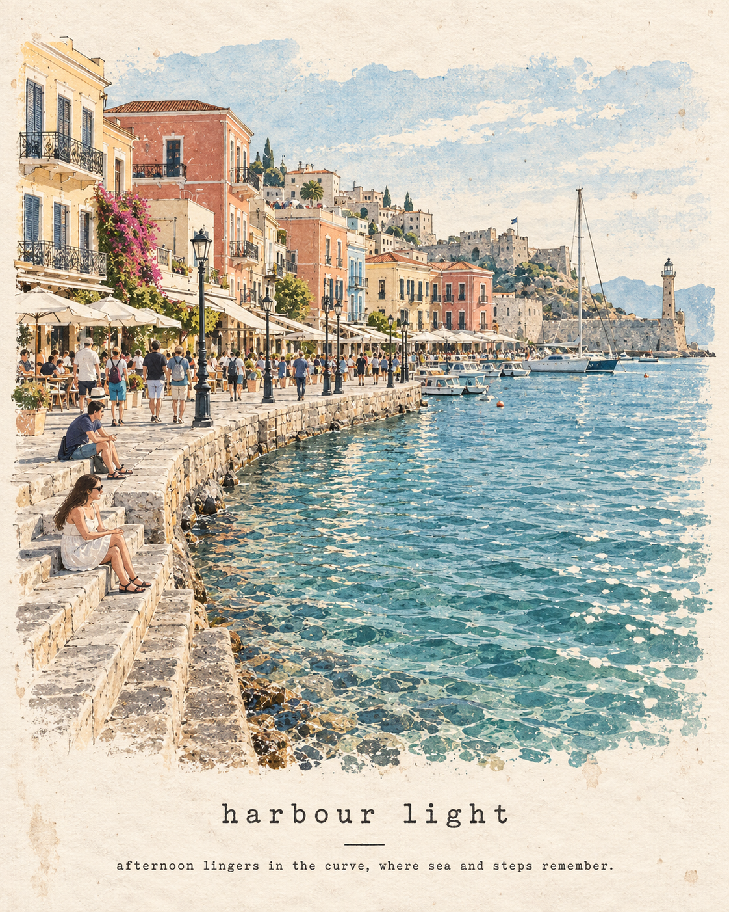

# 评测报告：GPT Image 2 · 海港旅行手帐海报

> 开源分享硬门槛：本页必须能直接看见成图。缺图 = 不可 PR。
> 对应提示词：[GPTImage2-海港旅行手帐海报](GPTImage2-海港旅行手帐海报.md)

## Prompt


> 本报告仅评测 **Prompt 1**（未跑 Prompt 2）。

```text
Transform the reference photograph into a minimalist editorial travel-journal poster. Preserve the recognizable architecture, curved waterfront promenade, sparkling sea, people, umbrellas, steps, and overall composition, but reinterpret the scene as a delicate hand-painted and screen-printed illustration. Use loose simplified shapes, fine imperfect ink outlines, muted blue, sea-green, warm beige, soft gray and terracotta accents, subtle watercolor washes, faded pigments, natural paper grain and slightly distressed vintage-print texture. Place the illustration on a warm ivory handmade paper background with generous negative space. Keep the architecture recognizable but artistic and simplified. Add elegant typewriter-style typography near the bottom reading “harbour light”, with the smaller line “afternoon lingers in the curve, where sea and steps remember.” Calm coastal mood, nostalgic travel diary aesthetic, sophisticated editorial composition, understated Japanese-inspired art zine, authentic handmade imperfections, premium print design, vertical 4:5 poster.
```

## Fixture

- `fixture`：synthetic harbour 参考；仅 Prompt1（未跑 Prompt2）
- `fixture_source`：`synthetic_codex`（Codex 合成 MAIN）
- `model` / 跑台：gpt-6-astra medium · Codex image_gen（prompt-lab / Codex image_gen）

## 成图（必嵌）

### MAIN-ref（synthetic_codex）



### B · 待测 Prompt 输出



## 摘要

通挂：海港构图+「harbour light」字强；风格偏 photo-wash 而非纯 screen-print（口味风险）；fixture=synthetic_codex。

## 判定

- 动作：入库
- 开源：可分享（图齐）
- 日期：2026-09-14

## 四维（可选短表）

| 维度 | 可见表现 |
| --- | --- |
| 结构 | 保留滨水 promenade/台阶/海面可识别 |
| 约束 | 仅 Prompt1；typography 命中 |
| 胡编/扩写 | 未混 Prompt2 巴士街景 |
| 可复现 | 风格偏 photo-wash，复跑口味差需知 |
