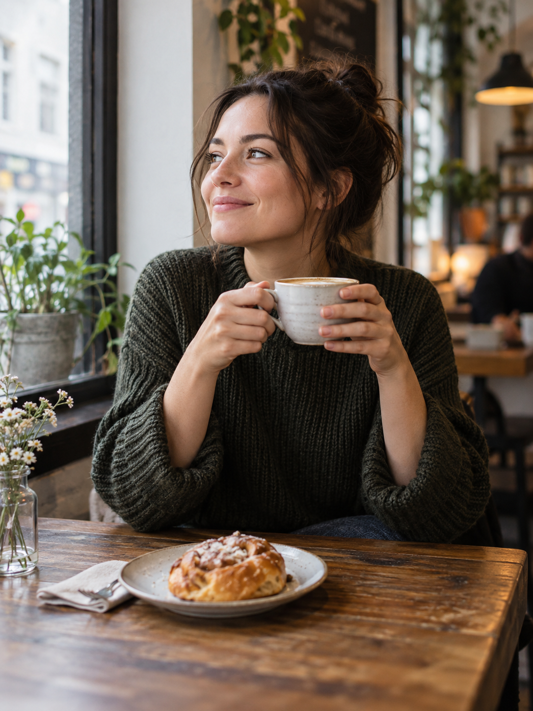
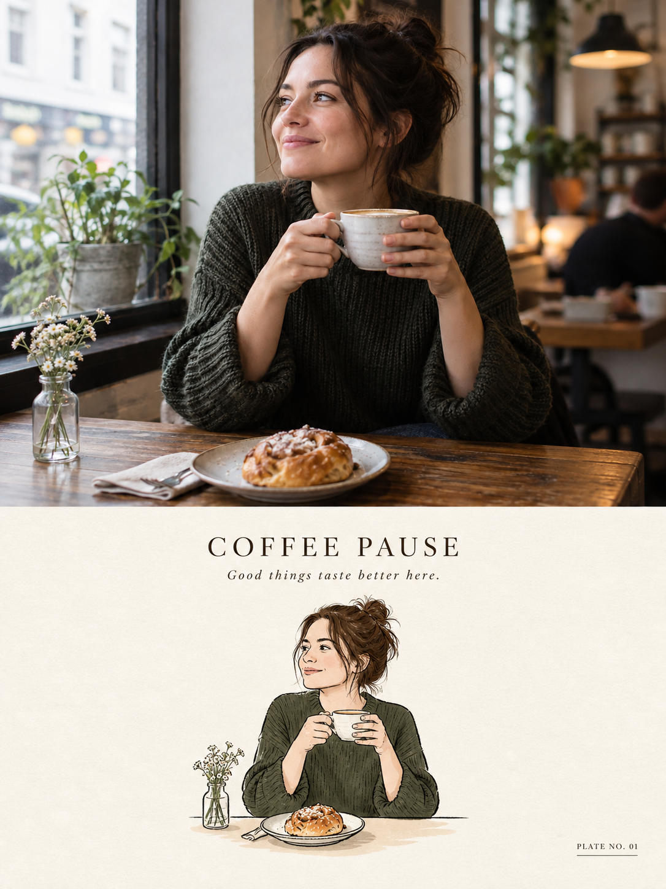

# 评测报告：GPT Image 2 · 照片+极简墨线 vignette

> 开源分享硬门槛：本页必须能直接看见成图。缺图 = 不可 PR。
> 对应提示词：[GPTImage2-照片加极简墨线vignette](GPTImage2-照片加极简墨线vignette.md)

## Prompt

```text
Create ONE refined PHOTO + MINIMAL INK VIGNETTE artwork based ONLY on the uploaded photograph.

FORMAT: Vertical 3:4.

### TOP — ORIGINAL PHOTO
Use approximately the upper 48–50% for the original photograph.

Preserve the photo faithfully and photorealistically. Do not redraw, beautify, replace, remove, duplicate, or invent important elements.

Preserve:
- people, animals, faces, clothing, poses and gestures
- food and objects
- buildings and environment
- perspective, lighting, colors and atmosphere

Only crop or scale proportionally when necessary.

### BOTTOM — MINIMAL INK VIGNETTE
Use a warm ivory / natural off-white paper background.

Study THIS photograph independently and identify the ONE main visual subject or small group that best represents the moment.

Illustrate only what matters. Remove roughly 70–90% of unnecessary background detail.

Recognition should come mainly from:
silhouette + shape + color + pose + 1–3 distinctive details.

Keep the illustration relatively small with generous negative space.

### STYLE
Vintage editorial / classic printed vignette.

Use:
- thin controlled dark-ink outlines
- slightly imperfect hand-drawn contours
- simple geometric forms
- restrained flat colors
- subtle tonal variation
- minimal texture
- soft grounding shadow
- clean shape separation

Keep it charming, graphic, tidy, nostalgic and understated.

Use fewer strokes than a detailed sketch.

Avoid:
photorealistic illustration, watercolor, painterly brushwork, dense sketching, cross-hatching, excessive outlines, comic-book style, anime/chibi, 3D rendering, vector-perfect geometry, or unnecessary tiny details.

### TITLE + CAPTION
Above the illustration, create:

ONE short editorial title: approximately 2–4 words, inspired specifically by the photograph.

ONE micro-caption: approximately 3–8 words, natural and understated.

Never use generic titles such as “Beautiful Moment,” “Sweet Memories,” or “Wonderful Day.”

If a recognizable place, landmark, food, brand, event, or subject is clearly visible, its real name may be used. Never guess.

### INDEX
Add a tiny bottom-right label based on the main subject:

- Food/drink → PLATE NO. 01
- Animal → PORTRAIT NO. 01
- Person/group → MOMENT NO. 01
- Place/architecture/landscape → VIEW NO. 01
- Object/miscellaneous → STUDY NO. 01

For a person + pet, normally use MOMENT NO. 01.

### FINAL FEEL
A beautifully curated personal visual archive:

REAL PHOTOGRAPH ABOVE  
+ SIMPLIFIED MEMORY BELOW  
+ SHORT EDITORIAL TITLE  
+ TINY HUMAN CAPTION  
+ ADAPTIVE INDEX

Quiet, minimal, collectible, elegant, and consistent.

IMPORTANT: Analyze every uploaded photograph independently. Never carry over subjects, objects, locations, colors, captions, or details from previous images.
```

## Fixture

- `fixture`：synthetic café life 上传照 → 上下分区 vignette
- `fixture_source`：`synthetic_codex`（Codex 合成 MAIN）
- `model` / 跑台：gpt-6-astra medium · Codex image_gen（prompt-lab / Codex image_gen）

## 成图（必嵌）

### MAIN-ref（synthetic_codex）



### B · 待测 Prompt 输出



## 摘要

通挂：上半原照忠实 + 下半墨线 vignette + INDEX/短标题；fixture=synthetic_codex。

## 判定

- 动作：入库
- 开源：可分享（图齐）
- 日期：2026-09-14

## 四维（可选短表）

| 维度 | 可见表现 |
| --- | --- |
| 结构 | 上下分区 + 暖象牙底 + INDEX |
| 约束 | 标题词数与微说明命中 |
| 胡编/扩写 | 未见明显胡编 |
| 可复现 | 换 synthetic MAIN 可复跑 |
