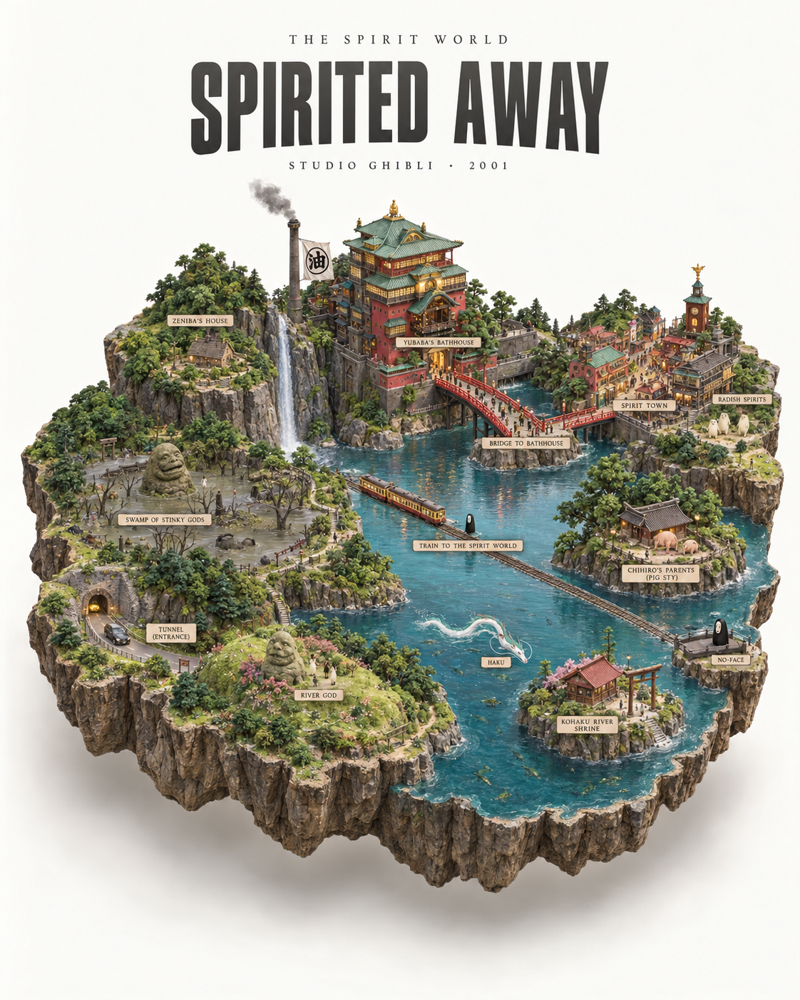

# 评测报告：GPT Image 2 · 等距动漫世界地图沙盘

> 开源分享硬门槛：本页必须能直接看见成图。缺图 = 不可 PR。
> 对应提示词：[GPTImage2-等距动漫世界地图沙盘](GPTImage2-等距动漫世界地图沙盘.md)

## Prompt

```text
Ultra-detailed photorealistic isometric miniature scale-model diorama of the world from [ANIME], floating on a pure off-white studio background with a soft drop shadow beneath.

If [ANIME] has a fictional world map: the diorama takes the exact silhouette shape of that fictional continent, island or region, extruded downward into a thick slab of raw rock and earth with rough natural cliff-like edges, like the world physically cut out and lifted. The shape matches the canonical map boundary precisely.

If [ANIME] is set in a real or semi-real world: the diorama takes the exact geographic silhouette shape of the primary city, region or country where the story is set, extruded into a thick rock slab with rough cliff edges.

The entire top surface faithfully recreates the complete world of [ANIME] with full anime accuracy: every region, city, landmark, building, terrain feature, road and environment in its exact canonical position as established in the show. Every iconic location is instantly recognizable to any fan — labeled with small readable location markers. The architecture, environment design, building styles, color palette and atmosphere must be completely faithful to the visual world of [ANIME] — not Western or generic realistic, but distinctly true to how this anime world looks and feels. Every location a fan would recognize is present and accurately placed.

Dense micro-detail throughout: tiny figures in show-accurate character designs and clothing, vehicles or creatures authentic to the world, individual trees and foliage, roads and paths between locations, flags and faction symbols, any distinctive environmental features unique to this anime world.

Style: hyper-realistic tilt-shift miniature photography — extremely sharp, everything in focus, no blur. Soft warm lighting from above, gentle diffuse shadows. Colors match the anime's authentic visual palette faithfully — rich, saturated and true to the show's identity.

Layout: the shaped diorama floats centered in the lower two-thirds of the frame, clear margins on all sides, never touching the frame edges. Upper third is empty off-white space with minimalist editorial typography, centered: small wide-tracked caps with the world or region name at the very top, then [ANIME] directly below in a bold condensed sans-serif in medium charcoal grey — large and dominant, the biggest text element, then small wide-tracked caps below with the studio name and year.

Minimalist editorial poster aesthetic, premium print quality, 4:5 aspect ratio.
```

## Fixture

- `fixture`：ANIME=Spirited Away
- `fixture_source`：`official`（用户/源图·官方槽位出图）
- `model` / 跑台：gpt-6-astra medium · Codex image_gen（prompt-lab / Codex image_gen）

## 成图（必嵌）

### B · 待测 Prompt 输出



## 摘要

通挂：Spirited Away 世界沙盘可识别（油屋等）+ 白底悬浮 + 上三分标题排版；纯文 MAIN。

## 判定

- 动作：入库
- 开源：可分享（图齐）
- 日期：2026-09-15

## 四维（可选短表）

| 维度 | 可见表现 |
| --- | --- |
| 结构 | 悬浮微缩沙盘+编辑标题区 |
| 约束 | ANIME=Spirited Away 世界元素可辨 |
| 胡编/扩写 | 未见无关西式写实世界抢戏 |
| 可复现 | 槽位填 Spirited Away 可复跑 |
