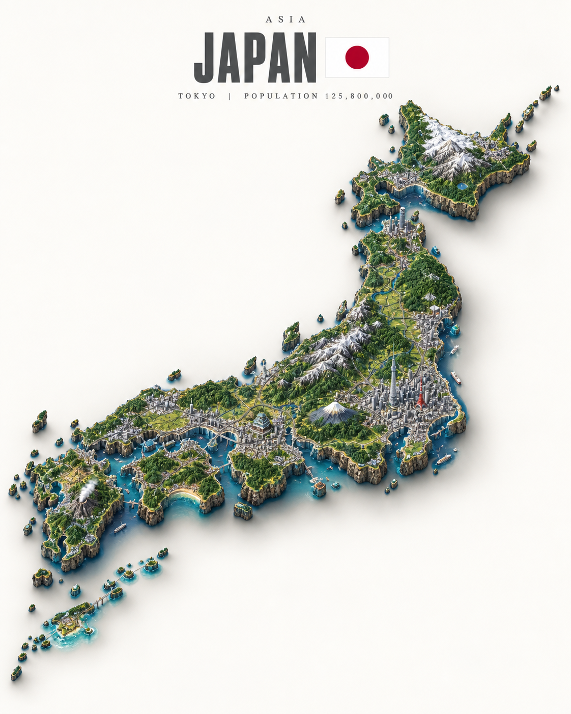

# 评测报告：GPT Image 2 · 等距国家微缩沙盘

> 开源分享硬门槛：本页必须能直接看见成图。缺图 = 不可 PR。
> 对应提示词：[GPTImage2-等距国家微缩沙盘](GPTImage2-等距国家微缩沙盘.md)

## Prompt

```text
Ultra-detailed photorealistic isometric miniature scale-model diorama of [COUNTRY], floating on a pure off-white studio background with a soft drop shadow beneath. The diorama takes the exact real-world silhouette shape of the country — not a square tile, but the true precise geographic outline of the country's borders and coastline, extruded downward into a thick slab of raw rock and earth with rough natural cliff-like edges, like a chunk of the real land physically cut out and lifted. The shape of the slab matches the country's actual geography precisely, including any islands, peninsulas or coastline indentations.

The entire top surface faithfully recreates the country's real geography and terrain: mountain ranges with correct elevation and snow coverage, rivers in their real positions, major forests and plains, deserts, coastlines with beaches and cliffs. Every major city is visible as a dense urban cluster in its correct geographic position. The country's most iconic landmarks are rendered in accurate positions and to recognizable scale. Terrain elevation is fully physically modeled — mountain ranges rise dramatically, valleys are sunken, plains are flat, creating real varied 3D topography across the entire surface.

Dense micro-detail: individual buildings in city clusters, tiny roads and highways connecting settlements, railways, bridges, harbors with boats, agricultural field patterns in rural areas, individual trees and forest coverage. Every region has its correct landscape character — the terrain of the north looks different from the south.

Style: hyper-realistic tilt-shift miniature photography — extremely sharp, everything in focus across the whole surface, no blur. Soft warm daylight from above, gentle diffuse shadows, rich natural colors. Lush greens, snow-capped peaks, golden plains, deep blue water along the coastline.

Layout: the shaped diorama floats centered in the lower two-thirds of the frame with clear margins on all sides, never touching the frame edges. Upper third is empty off-white space with minimalist editorial typography, centered: small wide-tracked caps with the continent or region name at the very top, then directly below [COUNTRY] in a bold condensed sans-serif in medium charcoal grey — large and dominant, the biggest text element — with a small flat rectangular flag of [COUNTRY] sitting immediately to the right of the country name, vertically centered with it, accurately colored and proportioned, clean flat design, sized to roughly the cap-height of the country name, floating naturally beside the name as one cohesive unit, not pushed to the far edge but sitting close and attached to the right end of the country name text. Then small wide-tracked caps below with the capital city and population.

Minimalist editorial poster aesthetic, premium print quality, 4:5 aspect ratio.
```

## Fixture

- `fixture`：COUNTRY=Japan
- `fixture_source`：`official`（用户/源图·官方槽位出图）
- `model` / 跑台：gpt-6-astra medium · Codex image_gen（prompt-lab / Codex image_gen）

## 成图（必嵌）

### B · 待测 Prompt 输出



## 摘要

通挂：Japan 列岛轮廓悬浮沙盘 + 白底软投影 + 上三分 Japan/旗编辑排版；4:5。

## 判定

- 动作：入库
- 开源：可分享（图齐）
- 日期：2026-09-15

## 四维（可选短表）

| 维度 | 可见表现 |
| --- | --- |
| 结构 | 国土轮廓沙盘居中下三分之二 |
| 约束 | Japan 槽位+旗帜排版命中 |
| 胡编/扩写 | 未见方形地砖替代轮廓 |
| 可复现 | 槽位填 Japan 可复跑 |
