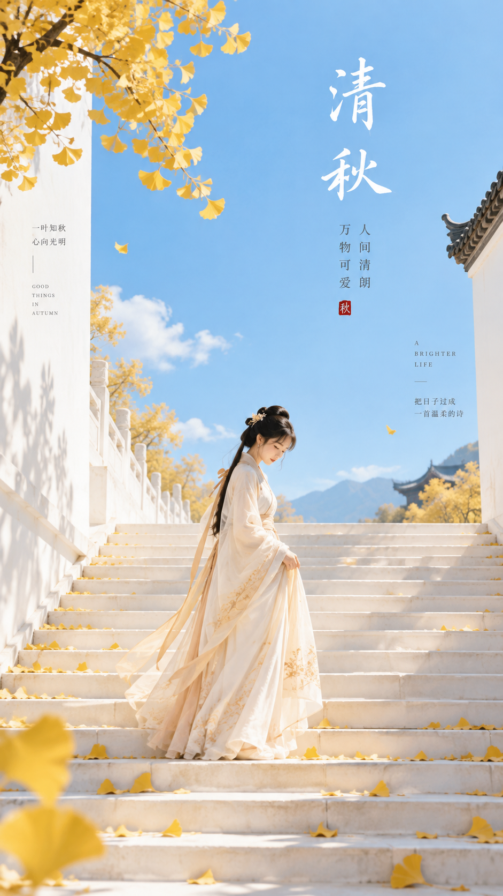

# 评测报告：GPT Image 2.5 · 东方禅意极简封面海报

> 开源分享硬门槛：本页必须能直接看见成图。缺图 = 不可 PR。
> 对应提示词：[GPTImage25-东方禅意极简封面海报](GPTImage25-东方禅意极简封面海报.md)

## Prompt

```text
主题方向：东方禅意极简封面海报
风格分支：女性审美明亮型
主体内容：一位古风女子站在浅色长阶中段，低头轻扶裙摆
情绪母题：轻松、清朗、秋日明媚感
场景与意象：银杏叶、白色台阶、晴空蓝背景、女子、少量树影
构图与空间：9:16 竖版构图，长阶从下方向上延伸形成视觉引导，人物位于中下部，顶部保留大面积干净标题区
色彩控制：奶白作为高明度基底，银杏黄用于落叶和局部点睛，晴空蓝用于远景天空色块，人物服装用浅米白或淡杏色；避免全图黄蓝滤镜化
光线与质感：明亮日光，边缘清晰，轻平面海报感，极轻纸面质感即可
画幅比例：9:16
补充要求：整体要明快、通透、有呼吸感，台阶结构要简洁高级，适合做高颜值封面
```

## Fixture

- `fixture`：无 MAIN；Codex B 成图
- `fixture_source`：`official`
- `model` / 跑台：gpt-6-astra medium · Codex image_gen · 2026-09-18 11:03 CST · batch9（429 后重跑）

## 成图（必嵌）

### B 成图



## 摘要

Codex `image_gen` pass；Inbox 三项齐后人判全收。B 成图内嵌。

## 判定

**accepted** — 可进 baize-prompts；读者可见 Prompt + 视觉证据。
