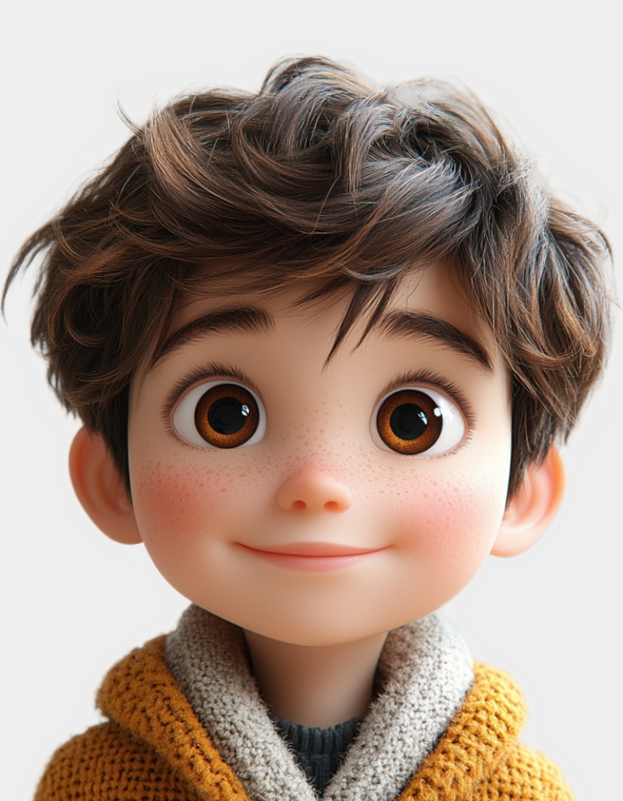
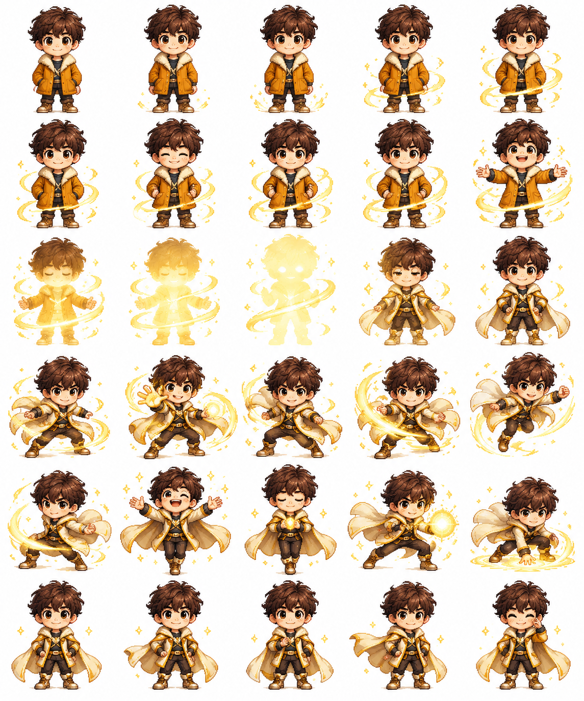

# 评测报告：GPT Image 2.5 · 像素变身 Sprite Sheet 5×6

> 开源分享硬门槛：本页必须能直接看见成图。缺图 = 不可 PR。
> 对应提示词：[GPTImage25-像素变身SpriteSheet5x6](GPTImage25-像素变身SpriteSheet5x6.md)

## Prompt

```text
以 角色参考图 作为整套动画中唯一且最高优先级的人物身份参考。

严格保持参考图中角色的：

脸部身份与五官特征 发型、发色、头饰 肤色 身材比例 初始服装 鞋子与配饰 角色气质 手持物 / 标志性道具

将人物重新表现为 高质量复古像素风角色动画，但人物身份必须清晰可辨。

生成一张完整的 pixel-art sprite sheet。

【固定规格】 5×6 网格 共 30 帧 播放顺序：从左到右、从上到下 每一帧都是同一段连续动画中的不同瞬间 白色纯背景 不要透明棋盘格 不要网格线 不要文字 不要帧编号 不要 UI 不要额外场景

每一帧必须完整显示角色全身，从头顶到脚底全部位于画面内。

【人物位置锁定】

这是最高优先级约束。

30 帧中始终保持：

人物身体中心位于完全相同的位置 脚底基线保持一致 人物整体比例保持一致 摄影机固定 镜头距离固定 角色不可左右漂移 角色不可上下跳动 不可因头发、武器、魔法特效范围变化而重新居中 所有帧以人物身体本体为锚点，而不是以光效或道具为中心

头发、裙摆、丝带、道具和特效可以运动，但人物主体站位不能漂移。

【30 帧动画结构】 Frames 1–5｜初始状态

角色保持参考图中的原始服装。

人物正面面对观众。

从自然站姿逐渐进入变身动作：

抬手 举起标志性道具 身体轻微转动 头发与衣服出现轻微跟随运动

只出现少量星光、粒子或微弱能量。

此阶段绝对不要提前换装。

Frames 6–10｜能量聚集

魔法能量开始增强。

加入符合角色主题的：

发光粒子 星星 光环 光带 符号 能量轨迹

光效从脚部逐渐向：

腿部 → 腰部 → 胸口 → 手臂

向上缠绕。

角色仍保持原始服装。

相邻帧变化必须细小、连续、平滑。

Frames 11–15｜核心变身阶段

这是整套动画最重要的换装阶段。

强烈的发光丝带、能量环或魔法光效逐渐包裹：

腿部 腰部 胸口 手臂

利用光效自然遮挡原始服装。

Frame 11–12： 原服装仍可辨认，光效开始遮挡。 Frame 13： 光效达到最强，身体主要服装区域被魔法光完全包裹。

Frame 14： 新服装第一次明显出现。 Frame 15： 新服装完成约 80–90%。

换装必须发生在光效遮挡过程中，不要突然硬切。 Frames 16–20｜新造型完整出现

角色完成换装。 变身后的服装使用：

@目标服装参考图

如果没有提供目标服装图，则根据角色本身的：

主色

标志性符号

发型

道具

人物气质 自动设计一套统一风格的 原创魔法战斗造型。 此时完整展示： 新上衣 新裙装 / 下装

手套

靴子

配饰 胸前装饰 腰部装饰 角色可以做小幅： 转身 抬腿 手臂展开

道具挥动

但人物主体位置依然保持锁定。 Frames 21–25｜变身高潮 进入视觉高潮。 出现更强烈但不遮挡人物主体的：

大型光环

星光

魔法符号

心形 / 月牙 / 花瓣 / 火焰 / 雷电等主题粒子

环形光带 背后能量图案 角色完成一个具有辨识度的英雄式 Pose。 这一阶段必须清楚展示完整新服装。 Frames 26–30｜最终定格 魔法光效逐渐减弱。

只保留少量：

星光

光点

小型符号

柔和余辉

角色回到稳定的最终站姿。 最后 3–4 帧必须： 全身完整 新服装清楚

角色位置稳定

特效不遮挡脸部与身体

适合直接制作 GIF 最后一帧与前面的动作节奏自然衔接。 【像素风要求】 高质量复古像素动画。 保持：

清晰像素边缘

一致像素密度

精细但不糊

色彩统一

角色轮廓清楚 面部五官可辨识 不要变成普通高清插画 不要半像素半写实 不要不同帧出现不同画风 所有 30 帧必须像由同一位像素动画师完成。 【强制连续性】 30 帧中严格保持同一个角色。 禁止出现：

换脸

发型变化

发色变化

身材比例变化

人物忽大忽小 人物漂移 多余人物 多余手脚 道具突然消失 道具造型变化 服装在错误帧提前改变 换装完成后又恢复旧服装 【最终输出目标】 整张图应该能够直接切割成 30 个独立画面。 每一个画面都必须： 白色背景 + 全身完整 + 人物身体中心一致 + 脚底基线一致 + 同一人物比例。 后续可以直接按照：

5 列 × 6 行

依次拆帧，再合成为 8 FPS / 10 FPS GIF。
```

## Fixture

- `fixture`：synthetic/桌面 MAIN 人像 + B 5×6 变身 sheet
- `fixture_source`：`synthetic_codex`（Codex/桌面合成 MAIN）
- `model` / 跑台：gpt-6-astra medium · Codex image_gen（prompt-lab / Codex image_gen）

## 成图（必嵌）

### MAIN-ref（synthetic_codex）



> 标注：`synthetic: true` · 桌面/Codex 合成参考人像。

### B · 待测 Prompt 输出



## 摘要

MAIN+B 双嵌；5×6 变身叙事通挂；画风偏精致像素可降注。

## 判定

- 动作：入库
- 开源：可分享（图齐）
- 日期：2026-09-16

## 四维（可选短表）

| 维度 | 可见表现 |
| --- | --- |
| 结构 | 5×6=30 帧白底 sprite sheet |
| 约束 | 身份锁定+站位锚点；变身阶段可读 |
| 胡编/扩写 | 未见换脸/多余人物 |
| 可复现 | MAIN+B 双嵌可核对身份保持 |
