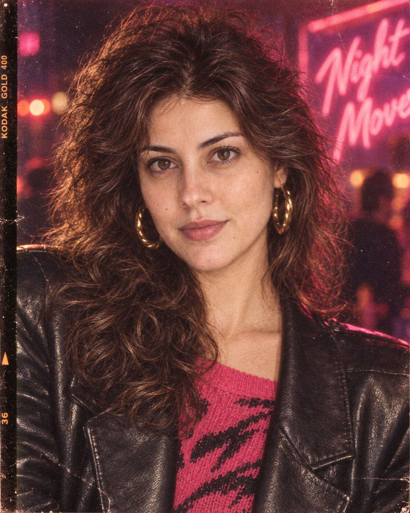

# 评测报告：GPT Image 2.5 · 八零年代复古人像

> 开源分享硬门槛：本页必须能直接看见成图。缺图 = 不可 PR。
> 对应提示词：[GPTImage25-八零年代复古人像](GPTImage25-八零年代复古人像.md)

## Prompt

```text
Create an authentic 1980s retro-vintage portrait in a 4:5 vertical aspect ratio, using the provided person as the exact facial reference. Preserve their identity, facial structure, recognizable features, skin tone, and natural expression with high accuracy—do not alter or beautify the face.

Give the subject a classic 1980s hairstyle and stylish period-accurate fashion with bold silhouettes, authentic textures, and effortless vintage attitude. Compose the portrait naturally with a strong editorial feel, keeping the subject as the clear focal point.

Capture the image as if shot on a 35mm analog film camera, with realistic film grain, subtle dust and texture, gentle softness, natural skin detail, slight color fading, and authentic analog imperfections. Use warm nostalgic color grading, soft neon highlights, subtle ambient glow, and direct on-camera flash to create the distinctive look of an iconic 1980s photograph.

Keep the lighting cinematic yet believable, with soft shadows, realistic highlights, natural contrast, and a slightly imperfect film exposure. The final image should feel genuinely photographed in the 1980s—not digitally recreated, with a timeless, nostalgic, fashionable, and effortlessly cool atmosphere.
```

## Fixture

- `fixture`：synthetic face MAIN（非用户实拍）→ 4:5 80s 复古胶片人像
- `fixture_source`：`synthetic_codex`（Codex 合成 MAIN · **synthetic face**，非用户实拍）
- `model` / 跑台：gpt-6-astra medium · Codex image_gen（prompt-lab / Codex image_gen）

## 成图（必嵌）

### MAIN-ref（synthetic_codex · synthetic face）


> 标注：`synthetic: true` · Codex 合成人脸参考，**非用户实拍**。

### B · 待测 Prompt 输出



## 摘要

通挂：80s发型服饰+胶片颗粒/机顶闪光+暖怀旧色；身份可对 synthetic MAIN；fixture=synthetic_codex（synthetic face）。

## 判定

- 动作：入库
- 开源：可分享（图齐）
- 日期：2026-09-15

## 四维（可选短表）

| 维度 | 可见表现 |
| --- | --- |
| 结构 | 4:5 竖幅人像焦点清晰 |
| 约束 | 胶片感/闪光/复古时尚命中 |
| 胡编/扩写 | 未见无关道具抢戏 |
| 可复现 | MAIN-ref+B 双嵌可核对身份保持 |
