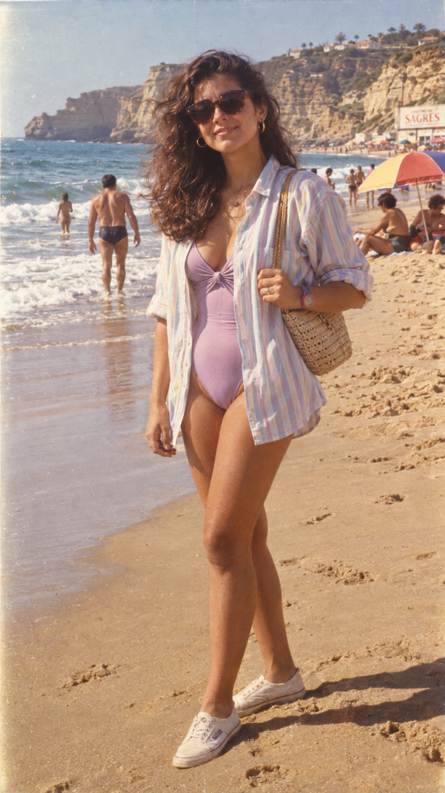

# 评测报告：GPT Image 2.5 · 八零年代葡萄牙海滩写真

> 开源分享硬门槛：本页必须能直接看见成图。缺图 = 不可 PR。
> 对应提示词：[GPTImage25-八零年代葡萄牙海滩写真](GPTImage25-八零年代葡萄牙海滩写真.md)

## Prompt

```text
Create an ultra-realistic vintage 1980s-style photograph of a clearly adult Portuguese woman in her mid-20s enjoying a sunny beach on the Portuguese coast. She has natural Mediterranean/Portuguese features, warm olive skin, expressive brown eyes, and thick dark-brown wavy hair with subtle natural volume, styled authentically like the early-to-mid 1980s.
She is standing near the shoreline on a beautiful Portuguese beach, with golden sand, Atlantic waves, distant cliffs and a few colorful beach umbrellas in the background. The atmosphere feels like a nostalgic summer holiday in Portugal around 1984–1987.
She wears an authentic 80s beach outfit: a high-waisted pastel swimsuit underneath a loose, slightly oversized striped linen shirt, rolled-up sleeves, white canvas sneakers, retro sunglasses, and a small woven shoulder bag. Add tasteful period-accurate accessories such as simple gold earrings and a colorful plastic watch. The outfit should feel stylish and effortless rather than costume-like.
Photography: shot on a vintage 35mm film camera, slightly low-angle candid composition, natural sunlight, subtle film grain, soft halation around highlights, realistic skin texture, gentle lens imperfections, slightly faded Kodak-style colors, warm highlights, moderate contrast, authentic analog exposure, tiny imperfections and natural motion in the hair from the ocean breeze.
The image should look like a real photograph taken in Portugal in the 1980s, not a modern recreation. No contemporary objects, smartphones, modern cars, modern buildings, or modern fashion. Natural candid expression, relaxed summer mood, cinematic but documentary-like realism, highly detailed, photorealistic, vertical 9:16 composition.
```

## Fixture

- `fixture`：无 MAIN；Codex B 成图
- `fixture_source`：`official`
- `model` / 跑台：gpt-6-astra medium · Codex image_gen · 2026-09-18 11:41 CST · batch10

## 成图（必嵌）

### B 成图



## 摘要

Codex `image_gen` pass；四闸过后人判全收。B 成图内嵌。

## 判定

**accepted** — 可进 baize-prompts；读者可见 Prompt + 视觉证据。
