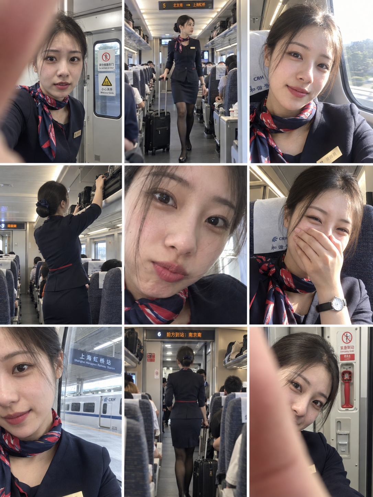

# 评测报告：GPT Image 2.5 · 列车乘务员 3×3 抓拍拼贴

> 开源分享硬门槛：本页必须能直接看见成图。缺图 = 不可 PR。
> 对应提示词：[GPTImage25-列车乘务员3x3抓拍拼贴](GPTImage25-列车乘务员3x3抓拍拼贴.md)

## Prompt

```text
ULTRA-REALISTIC CASUAL SMARTPHONE PHOTO COLLAGE, vertical 3:4, consisting of 9 separate candid snapshots arranged in a clean 3×3 grid, capturing the same young East Asian female train attendant during a normal workday aboard a modern passenger train.

Keep the same woman, same facial features, same hairstyle, same overall appearance, and same uniform consistently across every panel. She has dark brown hair neatly tied into a low bun, delicate natural features, subtle makeup, and a youthful appearance.

She wears a professional dark navy train-attendant uniform, a fitted blazer or elegant uniform dress, a red-and-navy patterned neck scarf, a small gold name badge, dark stockings, and simple professional shoes. Her appearance is polished but natural.

Panel 1: accidental close-up smartphone selfie inside the train vestibule, with one finger partially covering the lens, slightly blurry and imperfect, train doors and safety signage visible behind her.

Panel 2: full-body candid shot of her walking through the narrow train aisle while pulling a small black rolling suitcase, slight motion blur, passengers and rows of seats softly visible in the background.

Panel 3: close-up selfie from a train seat beside the window, bright natural sunlight entering through the glass and slightly overexposing part of her face, relaxed expression and casual framing.

Panel 4: candid rear/side view of her standing inside the train carriage while reaching toward an overhead luggage compartment, showing her neat low bun, uniform silhouette, and professional posture.

Panel 5: extremely close casual selfie, her face filling most of the frame with a few loose strands of hair crossing her face, soft focus, slightly imperfect smartphone exposure, playful natural expression.

Panel 6: candid seated selfie inside the train, one hand covering her mouth while laughing, wearing a simple wristwatch, warm carriage lighting, genuine spontaneous moment.

Panel 7: close-up side selfie beside a large train window, railway platform and another train visible outside, natural daylight, slightly cropped face and realistic reflections on the glass.

Panel 8: candid rear view of her walking through the train carriage toward another section, slight motion blur, overhead luggage racks, seats, doors, and realistic train interior details visible.

Panel 9: close-up accidental selfie inside the train vestibule, part of her finger covering the camera lens, playful imperfect framing, realistic train door controls and safety equipment behind her.

The whole collage should feel like real personal smartphone memories from a train attendant's workday, not professional photography. Use inconsistent framing, slight motion blur, accidental cropping, mild lens distortion, subtle exposure variations, realistic carriage lighting, soft focus, natural skin texture, authentic facial expressions, and small photographic imperfections.

No polished studio look, no artificial beauty filter, no plastic skin, no CGI appearance. Raw everyday smartphone photography, authentic behind-the-scenes train-attendant photo diary, realistic modern passenger train interior, spontaneous candid moments, consistent character across all 9 panels, thin white dividers between panels, clean 3×3 grid, vertical 3:4 aspect ratio.
```

## Fixture

- `fixture`：无 MAIN；3×3 九格同一乘务员日常抓拍拼贴
- `fixture_source`：`official`（文本直出 / 官方槽位）
- `model` / 跑台：gpt-6-astra medium · Codex image_gen（prompt-lab / Codex image_gen）

## 成图（必嵌）

### B · 待测 Prompt 输出



## 摘要

通挂：九格拼贴；同一乘务员/制服连贯，手机抓拍感可见。

## 判定

- 动作：入库
- 开源：可分享（图齐）
- 日期：2026-09-16

## 四维（可选短表）

| 维度 | 可见表现 |
| --- | --- |
| 结构 | 3×3 九格竖幅拼贴成立 |
| 约束 | 制服/发型跨格一致；车厢场景多样 |
| 胡编/扩写 | 未见无关职业或场景抢戏 |
| 可复现 | B 单嵌可核对九格连贯 |
