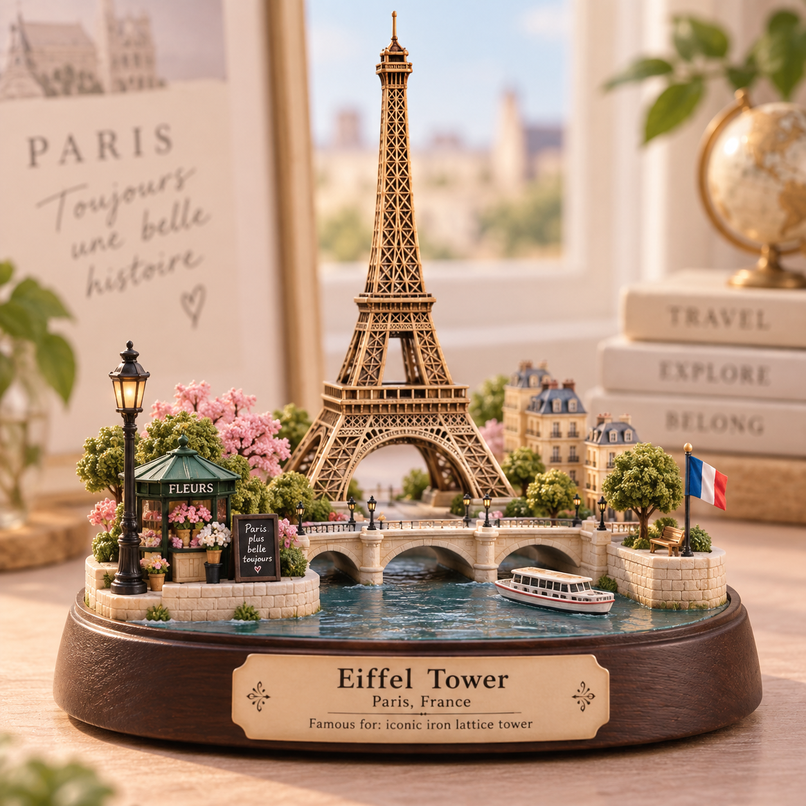

# 评测报告：GPT Image 2.5 · 地标迷你 3D 立体模型（Eiffel）

> 开源分享硬门槛：本页必须能直接看见成图。缺图 = 不可 PR。
> 对应提示词：[GPTImage25-地标迷你3D立体模型](GPTImage25-地标迷你3D立体模型.md)

## Prompt

```text
Create a premium cute miniature 3D diorama of Eiffel Tower, Paris, France. Keep the landmark recognizable, elegant, and charming, with clean composition, soft pastel tones, subtle handcrafted details, gentle natural lighting, and a refined travel-souvenir aesthetic.

Include minimal, tasteful text:
Eiffel Tower
Paris, France
Famous for: iconic iron lattice tower
```

## Fixture

- `fixture`：无 MAIN；Codex B 成图
- `fixture_source`：`official`
- `model` / 跑台：gpt-6-astra medium · Codex image_gen · 2026-09-18 11:57 CST · batch10

## 成图（必嵌）

### B 成图



## 摘要

Codex `image_gen` pass；四闸过后人判全收。B 成图内嵌。

## 判定

**accepted** — 可进 baize-prompts；读者可见 Prompt + 视觉证据。
