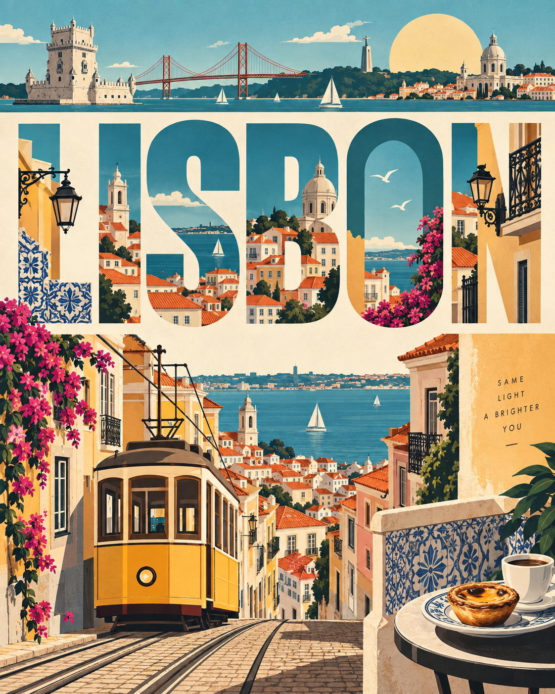

# 评测报告：GPT Image 2.5 · 地点旅行扁平海报（Lisbon）

> 开源分享硬门槛：本页必须能直接看见成图。缺图 = 不可 PR。
> 对应提示词：[GPTImage25-地点旅行扁平海报](GPTImage25-地点旅行扁平海报.md)

## Prompt

```text
Create an ultra-high-resolution premium travel poster for [Lisbon] in a strict 4:5 vertical format.

Automatically identify the most iconic and visually interesting elements of [Lisbon]—landmarks, architecture, streets, transportation, nature, food, culture, and skyline—and transform them into one cohesive flat-vector / modern travel-poster illustration.

Make [Lisbon] the dominant central typography using a bold, clean geometric sans-serif typeface. Integrate miniature local scenes and recognizable details inside or around the letters, creating a continuous visual story while keeping the location name perfectly readable.

Create a sophisticated full-frame composition with strong visual hierarchy and controlled negative space. Add a thin illustrated skyline or location-detail strip near the top featuring recognizable elements of [Lisbon].

Unify the typography, illustrations, geometric shapes, colors, and textures into one professional art direction.

STYLE: Mid-century modern × Swiss graphic design × premium international travel poster. Use flat geometric shapes, simplified architecture, clean vector edges, minimalist illustration, sophisticated editorial composition, and subtle screen-print texture.

Automatically choose a refined 3–5 color palette inspired by [Lisbon] and use it consistently throughout the artwork.

TYPOGRAPHY: All visible text must be English only. The primary headline is [Lisbon]. Spell it exactly, keep it complete, highly readable, professionally typeset, and undistorted. No random text, fake logos, Thai script, or watermarks.

The final artwork should feel like a world-class collectible tourism poster—timeless, sophisticated, artistic, clean, and instantly recognizable as [Lisbon].

STRICT 4:5 VERTICAL | Ultra-high resolution | Razor-sharp vector edges | Premium print quality | No reference image required.
```

## Fixture

- `fixture`：无 MAIN；Codex B 成图
- `fixture_source`：`official`
- `model` / 跑台：gpt-6-astra medium · Codex image_gen · 2026-09-18 11:54 CST · batch10

## 成图（必嵌）

### B 成图



## 摘要

Codex `image_gen` pass；四闸过后人判全收。B 成图内嵌。

## 判定

**accepted** — 可进 baize-prompts；读者可见 Prompt + 视觉证据。
