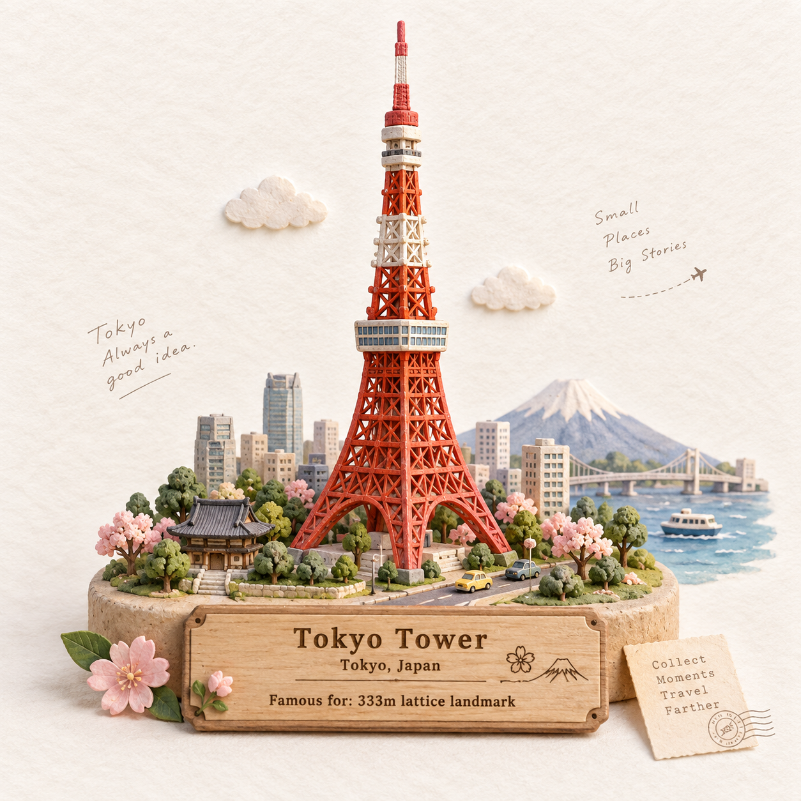

# 评测报告：GPT Image 2.5 · 手作微缩旅行场景

> 开源分享硬门槛：本页必须能直接看见成图。缺图 = 不可 PR。
> 对应提示词：[GPTImage25-手作微缩旅行场景](GPTImage25-手作微缩旅行场景.md)

## Prompt

```text
Create a charming handcrafted miniature travel scene featuring [ICONIC STRUCTURE] as the main focal point.
Show the landmark as a beautifully sculpted tiny 3D model, with soft rounded details, handmade textures, delicate imperfections, and a whimsical storybook feeling. Surround it with a few subtle elements that represent its location—such as tiny trees, flowers, streets, boats, mountains, clouds, or local objects—without making the scene crowded.

Place everything on a clean warm-white textured paper background, with plenty of elegant negative space. Add a small tasteful wooden or paper travel plaque containing:

[STRUCTURE NAME]
[CITY, COUNTRY]
Famous for: [SHORT UNIQUE FACT]

Use soft natural lighting, gentle shadows, pastel yet realistic colors, miniature diorama depth, handcrafted clay/paper textures, and a premium cute travel-journal aesthetic. Centered composition, highly detailed landmark, adorable but sophisticated, clean and collectible travel-card design, no photorealistic people, no clutter.
```

## Fixture

- `fixture`：ICONIC=Tokyo Tower; CITY=Tokyo, Japan; FACT=333m lattice landmark
- `fixture_source`：`official`（用户/源图·官方槽位出图）
- `model` / 跑台：gpt-6-astra medium · Codex image_gen（prompt-lab / Codex image_gen）

## 成图（必嵌）

### B · 待测 Prompt 输出



## 摘要

通挂：Tokyo Tower 微缩 diorama + 铭牌三行 verbatim；风险：背景手写短句/小飞机虚线轻微扩写。

## 判定

- 动作：入库
- 开源：可分享（图齐）
- 日期：2026-09-14

## 四维（可选短表）

| 维度 | 可见表现 |
| --- | --- |
| 结构 | 主焦塔 + 暖白纸底负空间 + 铭牌 |
| 约束 | 三行槽位文字正确 |
| 胡编/扩写 | 背景手写句与虚线轻微扩写 |
| 可复现 | 换 ICONIC/CITY/FACT 可复跑 |
