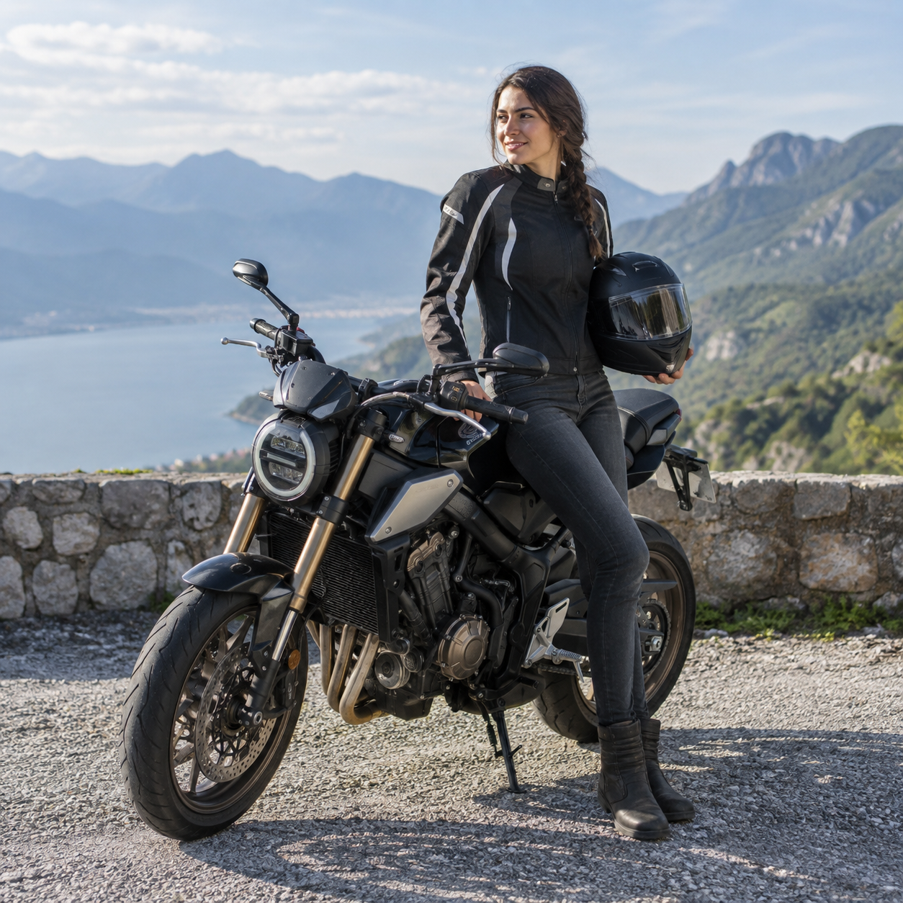
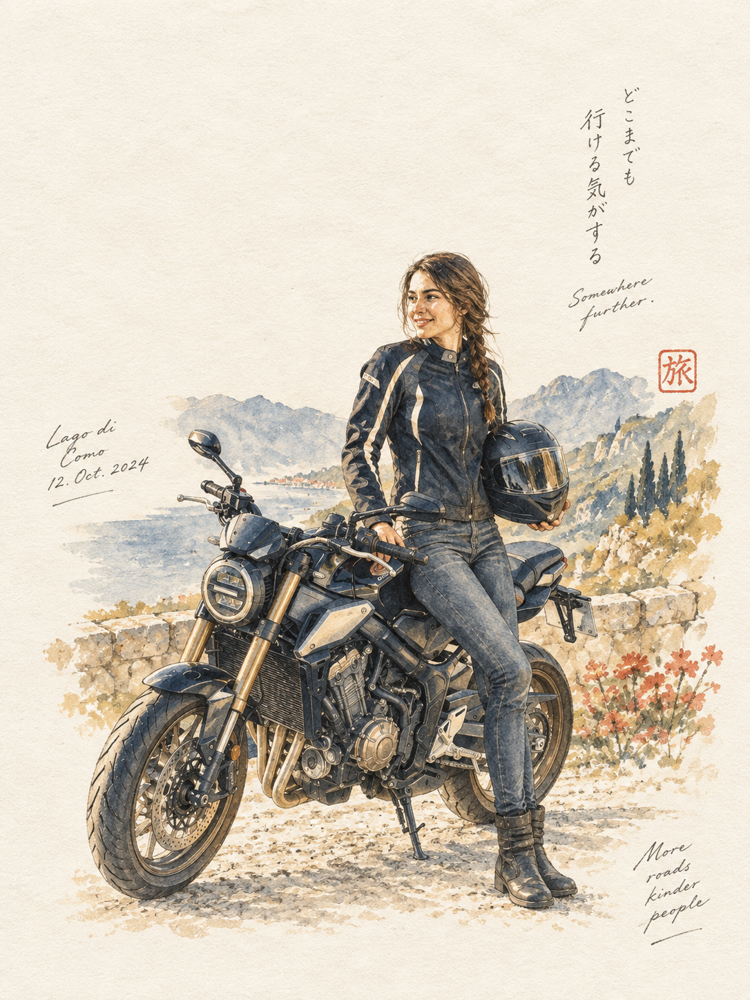

# 评测报告：GPT Image 2.5 · 摩托水彩旅行手帐插画

> 开源分享硬门槛：本页必须能直接看见成图。缺图 = 不可 PR。
> 对应提示词：[GPTImage25-摩托水彩旅行手帐插画](GPTImage25-摩托水彩旅行手帐插画.md)

## Prompt

```text
Created with GPT image 2.5

Prompt 

Create a standalone 3:4 vertical poetic editorial illustration based on the original photograph.
Reinterpret the woman and vintage motorcycle as a delicate hand-painted travel diary illustration. Preserve her pose, hairstyle, racing jacket, skirt, headphones, motorcycle and helmet.
Use translucent watercolor washes, fine graphite outlines, gentle dry-brush marks, subtle pencil imperfections and natural paper texture.
Place the illustration in the lower-middle portion of a warm white paper canvas with generous empty space surrounding it.
Use only four muted colors: dusty navy, faded mustard, soft brick red and warm beige.
The result should feel personal, nostalgic and intimate, like a page from an artist's Japanese travel journal — elegant, understated and handmade.
```

## Fixture

- `fixture`：synthetic_codex MAIN + B
- `fixture_source`：`synthetic_codex`
- `model` / 跑台：gpt-6-astra medium · Codex image_gen · 2026-09-18 10:50 CST · batch9（429 后重跑）

## 成图（必嵌）

### Synthetic MAIN



### B 成图



## 摘要

Codex `image_gen` pass；Inbox 三项齐后人判全收。双嵌 synthetic MAIN + B。

## 判定

**accepted** — 可进 baize-prompts；读者可见 Prompt + 视觉证据。
