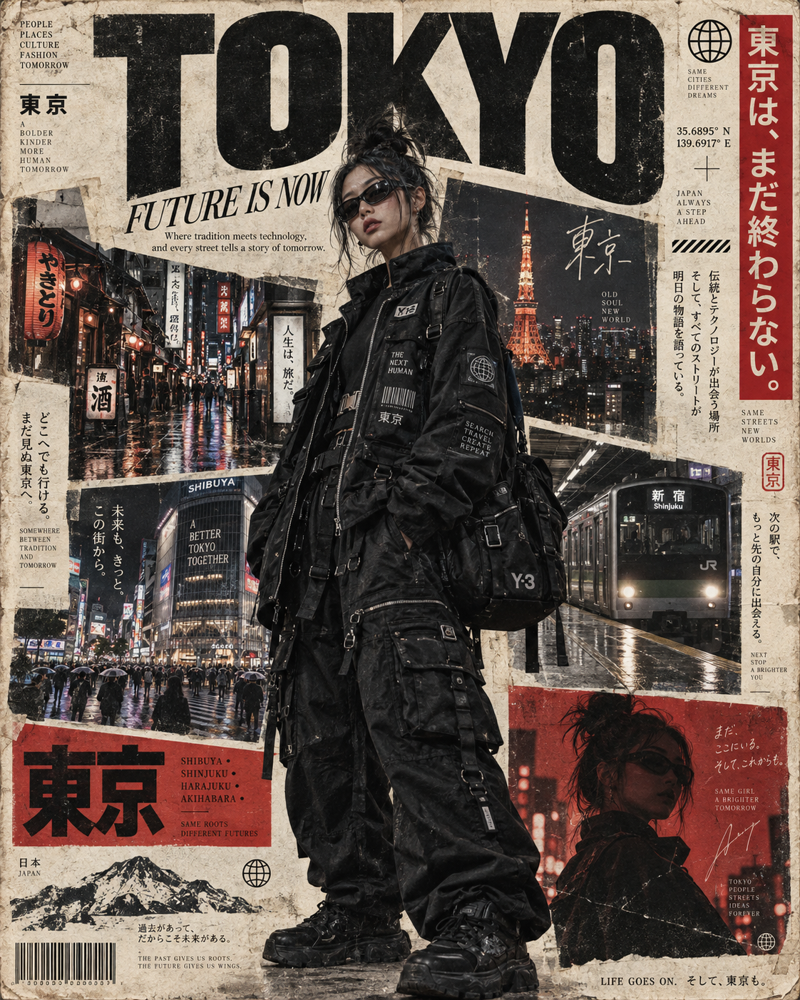

# 评测报告：GPT Image 2.5 · 日系街拍杂志封面时尚海报

> 开源分享硬门槛：本页必须能直接看见成图。缺图 = 不可 PR。
> 对应提示词：[GPTImage25-日系街拍杂志封面时尚海报](GPTImage25-日系街拍杂志封面时尚海报.md)

## Prompt

```text
Create a vertical 4:5 ultra-realistic editorial travel fashion poster inspired by a vintage Japanese street magazine cover.

A young woman stands prominently in the center foreground, photographed from a slightly low angle. She has dark hair tied into a messy high bun with loose strands framing her face, wearing narrow futuristic black wraparound sunglasses and looking slightly toward the camera with a confident, calm expression. She wears an oversized black technical utility jacket covered with realistic straps, buckles, zippers, pockets, printed patches, labels and subtle reflective details, paired with dark tactical-style clothing and a large black utility bag. Preserve realistic fabric texture and natural proportions.

The background is a Tokyo night street collage, featuring rain-soaked neon streets, Japanese shop signs, narrow urban alleys, Tokyo Tower glowing at night, and a Tokyo train arriving at a station. Arrange several rectangular photographs around the central subject at different slight angles, creating a handmade editorial scrapbook layout. Use off-white aged paper as the main background with subtle paper grain, worn edges, folds, stains and vintage print texture.

At the top, add huge bold black typography reading:

TOKYO

Under it, smaller elegant italic serif text:

FUTURE IS NOW

Add small editorial text blocks such as:

“Where tradition meets technology, and every street tells a story of tomorrow.”

Include minimalist globe symbols, technical graphic lines, barcode elements, coordinates, small labels and futuristic editorial markings.

Use Japanese-inspired red and black graphic panels throughout the composition. Add a vertical red panel on the right with Japanese typography, a red graphic card on the lower left containing large Japanese characters, and another red photographic panel in the lower right showing a dark silhouette of the woman.

Include small typography such as:

35.6895° N
139.6917° E

and:

SHIBUYA • SHINJUKU • HARAJUKU • AKIHABARA

Overall aesthetic: high-end Japanese streetwear magazine, cyberpunk Tokyo, vintage travel poster, contemporary fashion editorial, analog print collage. Muted black, charcoal, cream, dark gray and deep red color palette. Strong photographic realism, cinematic night lighting, subtle film grain, slightly faded ink, authentic paper texture, imperfect print registration, sophisticated magazine typography, balanced negative space.

Composition: central full-body subject, oversized “TOKYO” headline occupying the upper section, layered Tokyo photographs surrounding her, red graphic accents, vintage paper border, premium editorial layout.

Photorealistic, highly detailed, cinematic, 8K, realistic skin, realistic clothing textures, professional fashion photography, authentic vintage print finish, no modern digital UI elements.
```

## Fixture

- `fixture`：无 MAIN；Codex B 成图
- `fixture_source`：`official`
- `model` / 跑台：gpt-6-astra medium · Codex image_gen · 2026-09-18 12:03 CST · batch10

## 成图（必嵌）

### B 成图



## 摘要

Codex `image_gen` pass；四闸过后人判全收。B 成图内嵌。

## 判定

**accepted** — 可进 baize-prompts；读者可见 Prompt + 视觉证据。
