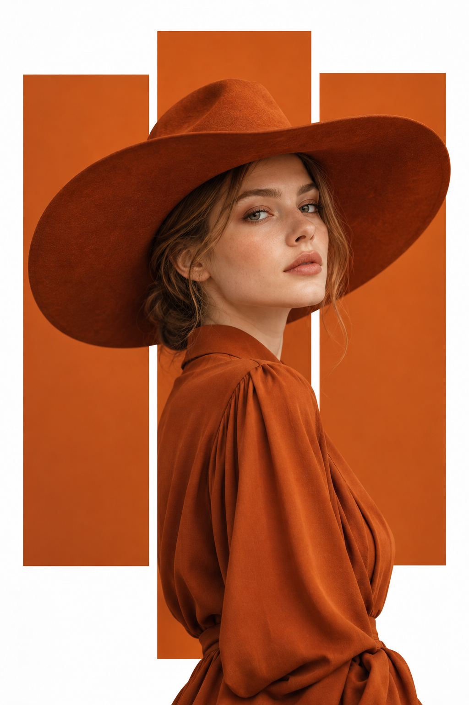

# 评测报告：GPT Image 2.5 · 橙板牛仔帽时尚海报

> 开源分享硬门槛：本页必须能直接看见成图。缺图 = 不可 PR。
> 对应提示词：[GPTImage25-橙板牛仔帽时尚海报](GPTImage25-橙板牛仔帽时尚海报.md)

## Prompt

```text
Create a vertical 2:3 fashion editorial poster with a minimalist, modern aesthetic. Use a clean white background with three tall, rectangular orange panels arranged vertically across the center, with narrow white gaps between them. The middle panel is slightly taller than the two outer panels.

Feature a realistic young woman with fair skin, delicate facial features, and light brown hair styled neatly under a large, wide-brimmed burnt-orange cowboy hat. She wears an elegant burnt-orange long-sleeve blouse with soft folds and a refined fashion-forward look.

Position the woman in a three-quarter profile, facing slightly toward the camera with a calm, confident expression. Her head and oversized hat extend across all three orange panels, while her body is primarily visible through the center panel. The orange panels should create a striking cutout effect, with parts of the portrait appearing to overlap the panel edges.

Use warm studio lighting, soft natural skin texture, subtle shadows, crisp edges, high-end fashion photography, balanced negative space, and a premium contemporary magazine design. Use a monochromatic burnt-orange color palette against a pure white background.

No text, no logos, no typography, no borders, no extra objects. Focus entirely on the woman, the oversized hat, and the geometric orange panel composition.
```

## Fixture

- `fixture`：无 MAIN-ref；三竖橙板+宽檐帽时尚海报文本出图
- `fixture_source`：`official`（用户/源图·官方槽位出图）
- `model` / 跑台：gpt-6-astra medium · Codex image_gen（prompt-lab / Codex image_gen）

## 成图（必嵌）

### B · 待测 Prompt 输出



## 摘要

通挂：白底三竖橙板+焦橙宽檐帽/2:3；偏差：人物切出/叠板效果略弱于理想。

## 判定

- 动作：入库
- 开源：可分享（图齐）
- 日期：2026-09-15

## 四维（可选短表）

| 维度 | 可见表现 |
| --- | --- |
| 结构 | 三板几何构图成立 |
| 约束 | 焦橙单色+白底；无文字/logo |
| 胡编/扩写 | 未见多余物件 |
| 可复现 | 主约束通挂；切出强度需人判 |
