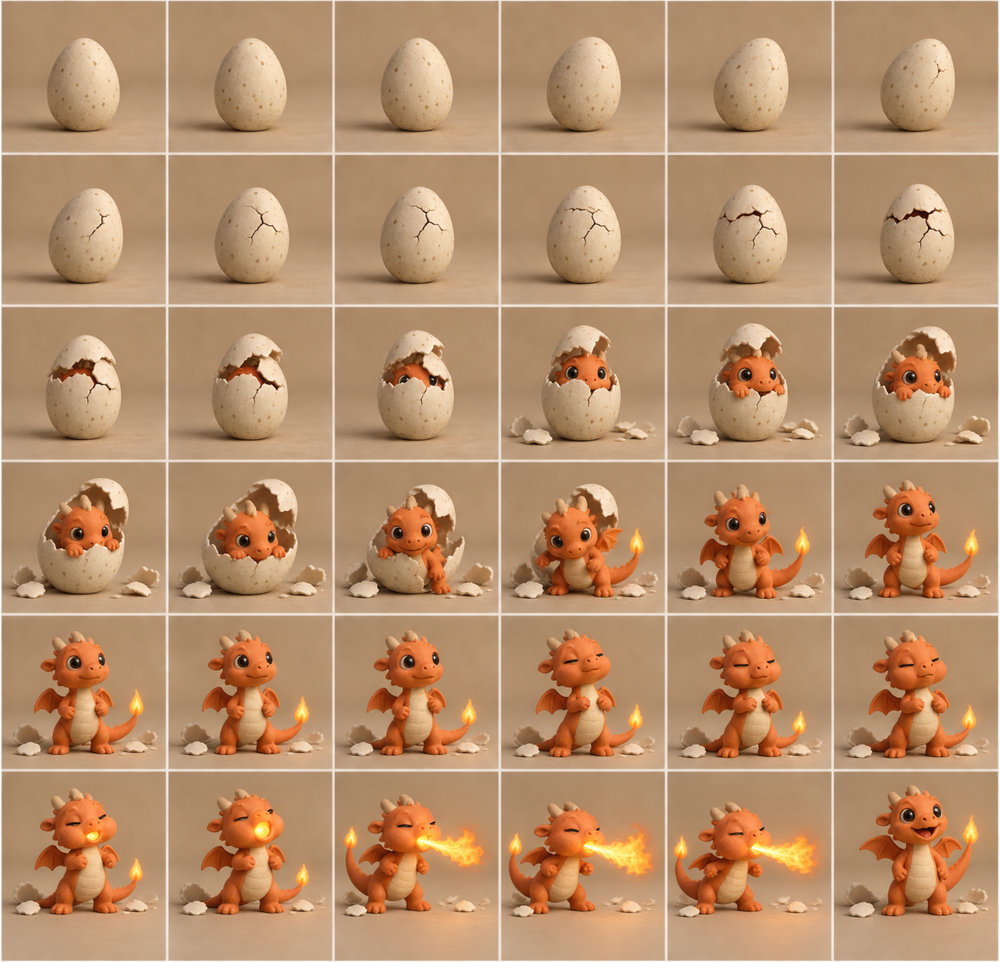
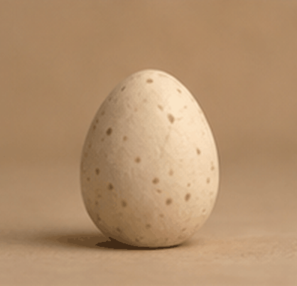

# 评测报告：GPT Image 2.5 · 粘土小火龙定格 36 帧

> 开源分享硬门槛：本页必须能直接看见成图。缺图 = 不可 PR。
> 对应提示词：[GPTImage25-粘土小火龙定格36帧](GPTImage25-粘土小火龙定格36帧.md)

## Prompt

```text
我要做stop motion animation
粘土风格
小火龙从蛋里面孵化成功，破壳而出，然后喷火。 规划好，输出36张图，然后合并在一起输出3s gif。
```

## Fixture

- `fixture`：无 MAIN；桌面 Codex 出拼贴 PNG + 3s GIF
- `fixture_source`：`official`（文本直出 / 官方槽位）
- `model` / 跑台：gpt-6-astra medium · Codex image_gen（prompt-lab / Codex image_gen）

## 成图（必嵌）

### B · 待测 Prompt 输出



### B GIF



## 摘要

桌面 Codex pass：破壳→喷火叙事可读；PNG+GIF 双嵌。

## 判定

- 动作：入库
- 开源：可分享（图齐）
- 日期：2026-09-16

## 四维（可选短表）

| 维度 | 可见表现 |
| --- | --- |
| 结构 | 定格拼贴+3s GIF 叙事可读 |
| 约束 | 粘土风格；破壳→喷火通挂 |
| 胡编/扩写 | 未见无关角色抢戏 |
| 可复现 | PNG+GIF 双嵌可核对动作连贯 |
