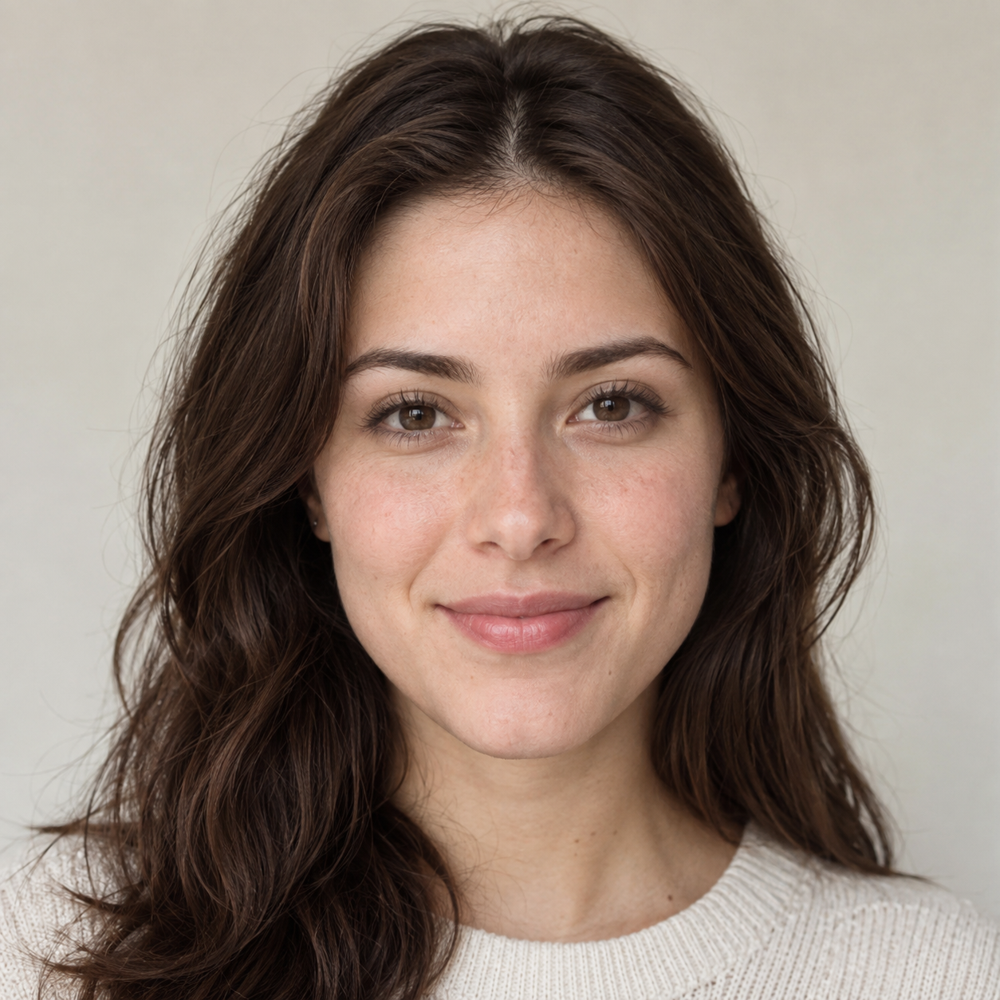
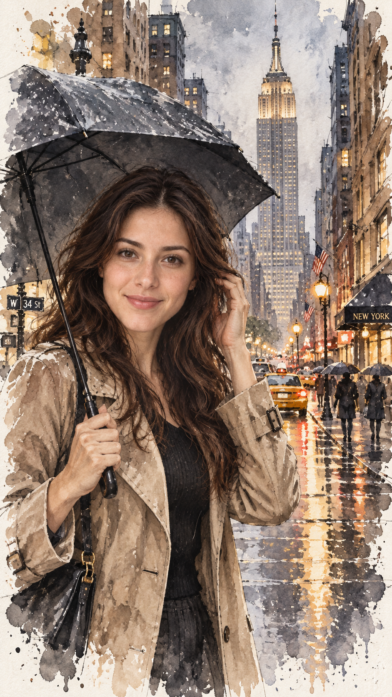

# 评测报告：GPT Image 2.5 · 纽约雨天水彩人像

> 开源分享硬门槛：本页必须能直接看见成图。缺图 = 不可 PR。
> 对应提示词：[GPTImage25-纽约雨天水彩人像](GPTImage25-纽约雨天水彩人像.md)

## Prompt

```text
TITLE: New York Rainy Day — Female Character Watercolor Portrait

New York Rainy Day — Female Character Watercolor Portrait

ASPECT RATIO: 9:16

REFERENCE INPUTS:
<<<FACE_REFERENCE>>>
Use the uploaded female face reference as the exact facial identity reference.

FACE REFERENCE RULES:
Preserve the female character's exact facial identity, facial structure, eyes, eyebrows, nose, lips, jawline, skin tone, and overall recognizable appearance from <<<FACE_REFERENCE>>>.
Do not redesign, replace, beautify into a different person, or alter her identity.
Maintain consistent facial proportions throughout the image.

SCENE:
A beautiful cinematic urban watercolor illustration of the female character standing on a rain-soaked Manhattan street with the Empire State Building towering dramatically in the background.

POSE:
The woman is positioned in the foreground, slightly turned three-quarters toward the camera.
She gently holds a black elegant umbrella with one hand while her other hand lightly adjusts a strand of hair near her face.
Her face is clearly visible.
She looks directly toward the viewer with a subtle confident smile and calm, sophisticated expression.
Natural fashion-editorial pose, graceful posture, relaxed shoulders, elegant body language.
The pose should feel like a trending cinematic Instagram/Pinterest portrait captured during a rainy New York evening.

OUTFIT:
Elegant modern city-fashion outfit, sophisticated neutral trench coat over a stylish fitted outfit, subtle accessories, natural flowing hair.
Premium fashion editorial aesthetic without looking artificial.

ENVIRONMENT:
Rainy Manhattan street, Empire State Building as the dominant architectural form in the center background, tall Art Deco buildings on both sides, wet asphalt, pedestrians with umbrellas, classic yellow taxis and modern cars, glowing street lamps, reflections in puddles.

ART STYLE:
Watercolor style combined with loose architectural acrylic painting;
fine ink sketching blended with soft watercolor washes;
urban sketch illustration;
expressive brushstrokes;
ink splatter and bleeding effects;
unfinished white borders;
cold-pressed textured watercolor paper;
highly detailed yet loose and airy.

COLOR PALETTE:
Warm earth tones—creamy beige, warm sand, burnt sienna, terracotta ochre, light umber, pale white, cool slate gray, soft Payne's gray-blue, touches of olive green and burnt orange.
Subtle warm golden highlights from street lights.

LIGHTING:
Soft rainy afternoon transitioning into warm evening light;
gentle glowing street lamps;
luminous reflections on wet pavement;
soft atmospheric perspective;
delicate shadows;
one dominant form—the Empire State Building—rendered sharp and bold.

DETAILS:
Intricate architectural details;
fine cross-hatched ink work;
wet-on-wet watercolor bleeding;
visible paper texture;
expressive loose shadow strokes;
natural watercolor imperfections;
subtle ink splatters;
beautiful reflections of the woman, umbrella, buildings and lights in the wet street.

COMPOSITION:
Vertical 9:16 cinematic composition.
Female character prominent in the foreground while the Empire State Building creates a powerful visual backdrop.
Balanced leading lines from the street toward the building.
Elegant negative space around the character.
Fashion editorial + travel postcard + premium watercolor illustration.

IMPORTANT:
Photorealistic facial identity translated into watercolor illustration.
Do not make the character cartoonish.
No anime.
No 3D render.
No plastic-looking skin.
No distorted hands.
No extra fingers.
No duplicated person.
No distorted face.
Keep the artwork painterly, sophisticated, loose, atmospheric and premium.

--ar 9:16 --style raw --stylize 250
```

## Fixture

- `fixture`：synthetic_codex MAIN + B
- `fixture_source`：`synthetic_codex`
- `model` / 跑台：gpt-6-astra medium · Codex image_gen · 2026-09-18 10:58 CST · batch9（429 后重跑）

## 成图（必嵌）

### Synthetic MAIN



### B 成图



## 摘要

Codex `image_gen` pass；Inbox 三项齐后人判全收。双嵌 synthetic MAIN + B。

## 判定

**accepted** — 可进 baize-prompts；读者可见 Prompt + 视觉证据。
