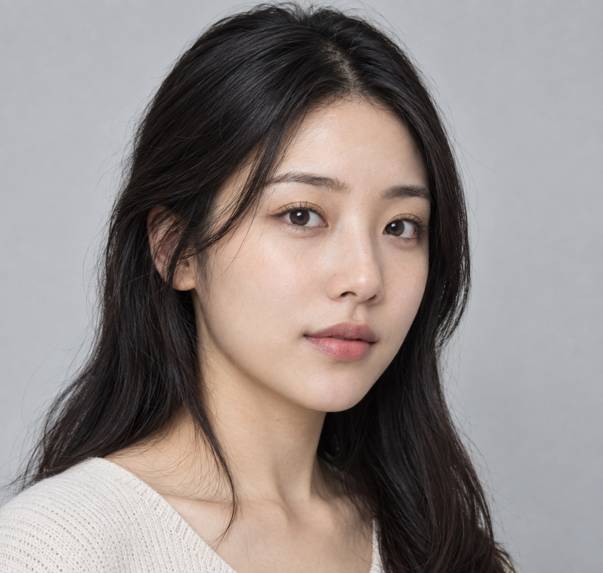
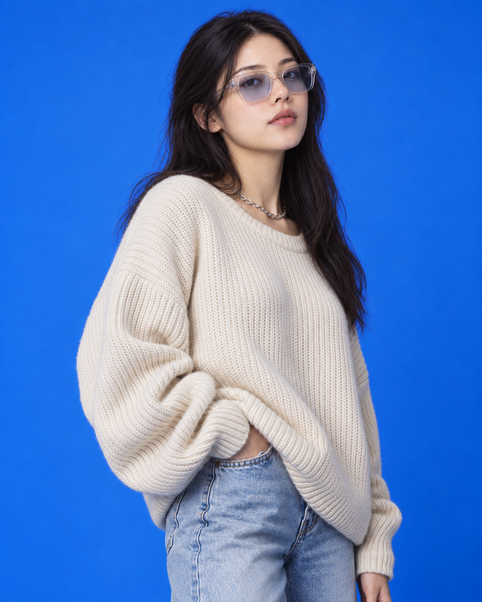

# 评测报告：GPT Image 2.5 · 蓝底棚拍时尚换人肖像

> 开源分享硬门槛：本页必须能直接看见成图。缺图 = 不可 PR。
> 对应提示词：[GPTImage25-蓝底棚拍时尚换人肖像](GPTImage25-蓝底棚拍时尚换人肖像.md)

## Prompt

```text
Create a high-end studio fashion portrait inspired by the uploaded blue-background reference photograph. Recreate the original composition with matching framing, focal length feel, camera position, subject scale, perspective, and overall visual balance while maintaining a realistic photographic appearance.

Replace the reference model with the character from the supplied character image. Preserve the character's authentic facial identity, bone structure, skin tone, eye shape, hairstyle, proportions, and recognizable features. Avoid beautification that alters identity. The face should remain naturally expressive and true to the source character.

Match the original body language closely: upper torso visible, shoulders relaxed, chin slightly elevated, eyes directed upward beyond the camera, conveying quiet confidence and contemplation. Maintain the same sense of presence and spatial positioning within the frame.

Retain the rich cobalt-blue studio backdrop and the refined editorial atmosphere. Reproduce the original lighting setup with soft directional illumination, subtle facial highlights, realistic reflections on eyewear and jewelry, and smooth shadow transitions around the jawline, neck, and clothing folds. Preserve depth, dimensionality, and studio realism.

Style the character in contemporary oversized street-fashion apparel. Use a premium relaxed-fit knit sweater or sweatshirt with natural fabric draping, layered with a minimalist chain necklace and lightly tinted translucent eyewear. The wardrobe may be customized to suit the character, but should maintain the same luxurious oversized silhouette and fashion-campaign aesthetic.

Keep the image tightly composed with the same portrait crop and subject placement. Ensure identical camera-to-subject distance and visual weight in the frame. The final result should feel indistinguishable from a genuine professional photoshoot captured in this exact studio environment.

Photorealistic editorial photography, luxury fashion campaign, cinematic studio portrait, premium streetwear styling, deep monochromatic blue backdrop, realistic skin texture, subtle film-grade contrast, detailed fabric rendering, natural lighting falloff, commercial advertising quality, shallow depth of field, magazine-cover aesthetics.

Negative Prompt:

Do not alter the background color or studio environment. Do not change the pose, framing, crop, perspective, subject distance, lighting direction, or gaze. Do not modify facial identity, facial proportions, skin tone, or hairstyle. Avoid excessive retouching, artificial skin smoothing, stylized illustration effects, exaggerated sharpening, extra accessories, text overlays, logos, watermarks, duplicate subjects, or unrealistic clothing physics.
```

## Fixture

- `fixture`：synthetic_codex MAIN + B
- `fixture_source`：`synthetic_codex`
- `model` / 跑台：gpt-6-astra medium · Codex image_gen · 2026-09-18 11:51 CST · batch10

## 成图（必嵌）

### Synthetic MAIN



### B 成图



## 摘要

Codex `image_gen` pass；四闸过后人判全收。双嵌 synthetic MAIN + B。

## 判定

**accepted** — 可进 baize-prompts；读者可见 Prompt + 视觉证据。
