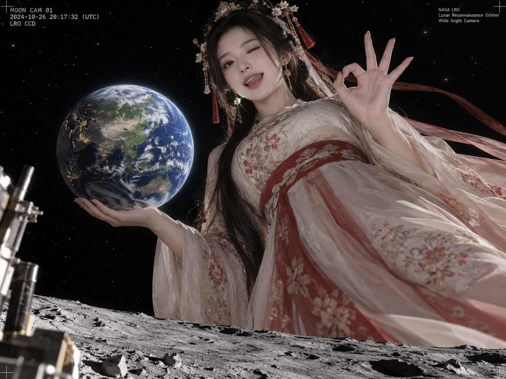

# 评测报告：GPT Image 2.5 · 行星级汉服巨人模板

> 开源分享硬门槛：本页必须能直接看见成图。缺图 = 不可 PR。
> 对应提示词：[GPTImage25-行星级汉服巨人模板](GPTImage25-行星级汉服巨人模板.md)

## Prompt

```text
真实东方汉服女性 × 行星级真人放大 × 手托🌍 × 😜👌 × 月球视角CCD相机抓拍 × 黑色宇宙背景
——————————

通用模版：

真实【人物身份】 × 【超尺度设定】 × 【核心动作＋主体】 × 【emoji 表情＋手势】 × 【特殊视角＋相机抓拍】 × 【背景环境】
```

## Fixture

- `fixture`：无 MAIN；行星级汉服巨人场景直出
- `fixture_source`：`official`（文本直出 / 官方槽位）
- `model` / 跑台：gpt-6-astra medium · Codex image_gen（prompt-lab / Codex image_gen）

## 成图（必嵌）

### B · 待测 Prompt 输出



## 摘要

真图非空壳；汉服巨人尺度与模板意图可读。

## 判定

- 动作：入库
- 开源：可分享（图齐）
- 日期：2026-09-16

## 四维（可选短表）

| 维度 | 可见表现 |
| --- | --- |
| 结构 | 行星尺度汉服巨人构图成立 |
| 约束 | 托地球+月球CCD视角+宇宙背景可读 |
| 胡编/扩写 | 未见无关主体抢戏 |
| 可复现 | 模板槽位清晰，可换身份复跑 |
