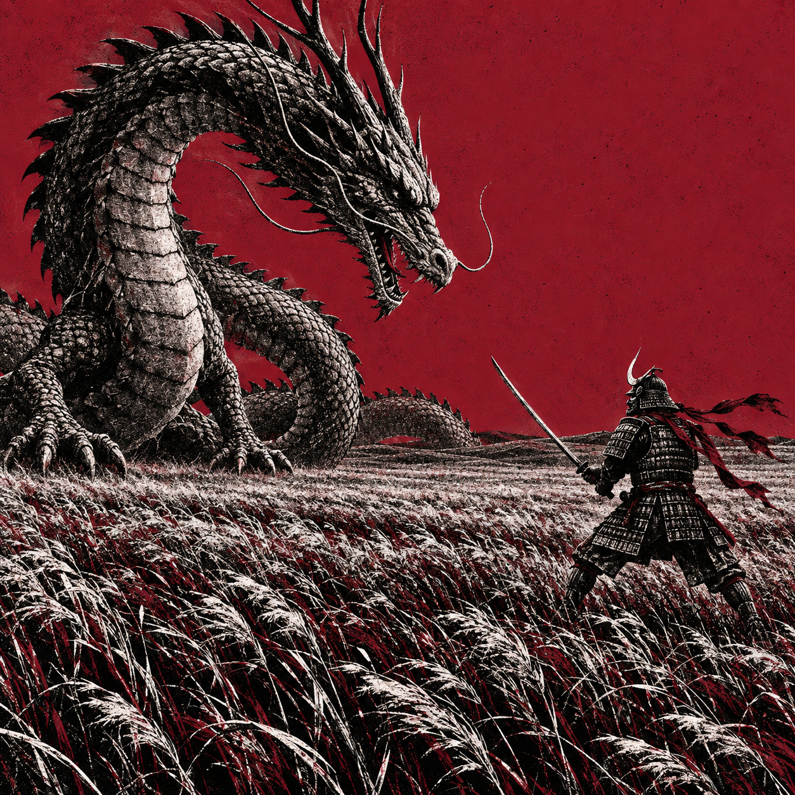

# 评测报告：GPT Image 2.5 · 龙武士草原对峙

> 开源分享硬门槛：本页必须能直接看见成图。缺图 = 不可 PR。
> 对应提示词：[GPTImage25-龙武士草原对峙](GPTImage25-龙武士草原对峙.md)

## Prompt

```text
Create a single square 1:1 artwork, 2048 × 2048.

"SCENE AND COMPOSITION
A giant Japanese dragon confronting a lone samurai in a vast windswept grassland. Wide view, fixed low camera, both subjects clearly situated in the same landscape. The dragon dominates the left side; the full-body samurai stands on the right, facing left toward the dragon. Leave a clear gap between them. A low, gently rolling horizon divides the open sky from the dense grassy field.

DRAGON
An unmistakably reptilian Japanese serpentine dragon with a long coiled body and an elegant S-curving neck. Large overlapping scale plates, broad segmented belly scutes, hard triangular dorsal spines, swept-back antler-like horns and a few long, smooth whiskers. An elongated reptilian skull with visible nostrils, an armored brow and a slightly open jaw showing sharp conical teeth. Powerful clawed forelimbs planted in the grass. Its head angles downward toward the samurai.

Completely hairless: no fur, mane, beard, feathers, wolf ears or mammalian muzzle. No wings. Define the body with individual scale plates, never hair-like strokes.

SAMURAI
A full-body warrior seen from a three-quarter back/profile angle. Traditional kabuto helmet with a crescent crest, menpo mask, layered shoulder guards, intricately laced lamellar armor, divided armored skirt and shin guards. Knees slightly bent, feet firmly planted, torso leaning into a defensive stance. Both hands hold one katana diagonally upward-left between him and the dragon. Long cloth ties stream sideways in the wind.

FIELD
Dense tall grass fills the foreground and stretches far into the distance. Large bent blades and seed heads near the camera, progressively finer grass toward the horizon. Broad curved bands of leaning grass suggest wind rippling across the entire field. Rich, irregular white scratches describe individual stems against deep black masses.

PALETTE AND RENDERING
A strictly limited palette of cool dark cherry red, approximately #901C35, absolute black and near-white. Flat cherry-red sky; the same red appears between grass blades and in the samurai’s cloth ties.

Realistic dimensional forms translated into an aggressively thresholded black-and-white xerox print. Crushed black shadows, fractured white highlights, dense stippled dithering, scratched engraving, irregular ink coverage and crunchy, slightly pixelated edges. A gritty photocopied dark-fantasy image, not polished digital painting. Preserve fine detail in scales, armor and grass.

No smooth gradients, glossy CGI, clean anime shading, soft lighting, orange-red sky, buildings, trees, mountains, sun, moon, extra characters, duplicate swords, text, logos, borders, panels or watermarks. One complete full-bleed image."
```

## Fixture

- `fixture`：无 MAIN-ref；单次 MAIN 出图（方图 1:1 龙武士草原对峙）
- `fixture_source`：`official`（用户/源图·官方槽位出图）
- `model` / 跑台：gpt-6-astra medium · Codex image_gen（prompt-lab / Codex image_gen）

## 成图（必嵌）

### B · 待测 Prompt 输出



## 摘要

通挂：龙左武士右、红天 xerox、草原低机位；风险：实出分辨率~1254 低于提示 2048（引擎默认，不挡风格复现）。

## 判定

- 动作：入库
- 开源：可分享（图齐）
- 日期：2026-09-14

## 四维（可选短表）

| 维度 | 可见表现 |
| --- | --- |
| 结构 | 对峙构图成立，间隙留白清晰 |
| 约束 | 限色樱桃红/黑/近白；无翅无毛蛇龙命中 |
| 胡编/扩写 | 未见多余角色/字幕/建筑 |
| 可复现 | B 样张风格通挂，可复跑 |
